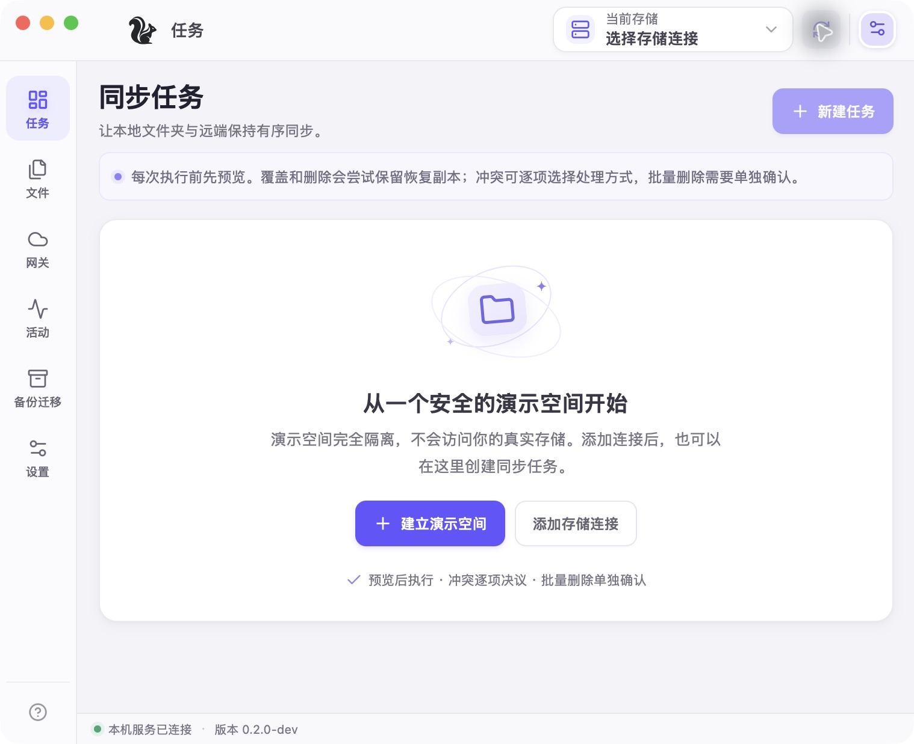

# 小花鼠（Tamias）

轻量的 WebDAV / S3 桌面客户端，支持文件同步、备份恢复，以及将 S3 存储通过 WebDAV 提供给其他应用。

基于 Go、Wails 和 Vue 构建。当前版本为 **0.2.0-beta.3**。



## 下载与安装

从 [GitHub Releases](https://github.com/l0o0/tamias/releases) 下载对应系统的安装包：

| 系统 | 格式 | 使用方式 |
| --- | --- | --- |
| Windows x64 | `.exe` 安装程序 | 按向导安装；需要 WebView2 Runtime |
| macOS 12+，Apple Silicon / Intel | `.pkg` 安装程序 | 按芯片选择安装包，安装到“应用程序” |
| Linux x64 | `.AppImage` | 添加执行权限后直接运行，要求 glibc 2.39+ |

```sh
chmod +x tamias-0.2.0-beta.3-linux-amd64.AppImage
./tamias-0.2.0-beta.3-linux-amd64.AppImage
```

没有 FUSE 的 Linux 环境可改用 `./tamias-0.2.0-beta.3-linux-amd64.AppImage --appimage-extract-and-run`。

Linux 需要 X11 / XWayland 和允许 WebKit 沙箱运行的用户命名空间；Ubuntu 的 AppArmor 配置及其他依赖见 [Linux 使用说明](docs/linux.md)。

当前为预发布版本。Windows 安装器未签名，macOS 安装器未签名或公证，系统可能提示未知发布者或阻止直接打开。安装包、校验值与具体要求见对应 Release；更新前请退出旧版本。

## 功能

- **存储连接**：连接 WebDAV 和 S3 兼容存储，支持自定义 Endpoint、Bucket、路径前缀及临时凭据。
- **文件管理**：浏览、上传、下载、复制、移动和重命名文件，查看与恢复 S3 历史版本。
- **增量同步**：文件级双向同步、单向上传或下载及镜像模式，支持排除规则、执行预览和冲突处理。
- **WebDAV 网关**：为 S3 存储提供 WebDAV 入口，支持独立凭据、路径隔离、只读模式和 TLS。
- **备份恢复**：创建远端快照，配置定时备份与保留策略，恢复到新的本地目录。
- **存储迁移**：在 WebDAV / S3 之间复制数据，经本机中转并逐文件核验。
- **本地缓存**：按需下载、固定文件、离线访问，以及编辑后的条件上传。
- **后台运行**：托盘、计划任务、带宽与容量限制；提供独立 CLI。

推送 `v<版本>` 标签后，GitHub Actions 会自动构建并发布上述四个平台的安装包；也支持在 GitHub 上发布 Release 后自动附加安装包。详见 [发布指南](docs/releasing.md)。

## 构建与运行

### 环境要求

- Go **1.25.0**，Node.js **24** 与 npm。
- `make`、POSIX shell，以及支持 CGO 的 C 编译器；Windows 可使用相应的开发工具环境。
- macOS：Xcode Command Line Tools。
- Windows：WebView2 Runtime。
- Linux：GTK 4、WebKitGTK 6.0 开发库和 `pkg-config`。Ubuntu / Debian 对应包为 `libgtk-4-dev libwebkitgtk-6.0-dev build-essential pkg-config`，需要提供这些版本的发行版。

平台依赖参见 [Wails 安装文档](https://v3.wails.io/quick-start/installation/)。项目固定使用 Wails `v3.0.0-beta.27`，构建无需安装 Wails CLI。

```sh
git clone https://github.com/l0o0/tamias.git
cd tamias
make setup
make build
```

| 平台 | 构建产物 | 验证状态 |
| --- | --- | --- |
| macOS | `bin/tamias.app` | Apple Silicon 已实机验证；本机构建使用 ad-hoc 签名，未公证 |
| Windows | `bin/tamias.exe` | 提供构建配置，桌面交互待验证 |
| Linux | `bin/tamias/tamias` | 提供构建配置，桌面交互待验证 |

macOS 启动：

```sh
open bin/tamias.app
```

### 首次使用

1. 在“设置”添加 WebDAV 或 S3 连接，填写地址及凭据。
2. 添加连接时自动检测并保存服务能力，连接成功后即可上传和同步；同名文件按原路径更新。严格防覆盖与读写网关按实际检测到的能力启用。
3. 在“同步”选择本地目录和远端路径，预览同步计划，再执行同步。
4. 需要为其他应用提供 WebDAV 时，在“工具”的“WebDAV 共享”创建入口；默认仅监听本机，局域网访问需配置 TLS。

也可以使用“建立演示空间”体验功能。演示远端仅存在于内存，退出后远端文件与快照会消失，不应用于保存正式数据。

## 命令行

```sh
make cli
bin/cli/tamias -data-dir ./tamias-state status
bin/cli/tamias -data-dir ./tamias-state diagnostics
```

CLI 支持配置导入导出、连接管理、同步预览与执行，以及无界面网关服务。参数放在子命令前；同一数据目录仅允许一个进程使用。完整用法见 [CLI 指南](docs/cli.md)。

改名继续使用既有 `Tami` 数据目录、`io.tamiops.tami` 应用与凭据库标识、登录启动注册文件、`X-Tami-Client` 请求头和 `.tamiops-backup` 备份格式。已有配置与凭据无需迁移；源码 Go module 和 `cmd/tami` 入口保持兼容。CLI 凭据密钥优先读取 `TAMIAS_VAULT_KEY`，同时兼容旧变量。

## 使用限制

- 增量同步以文件为单位，不包含块级去重、虚拟磁盘或占位文件。自动跳过 macOS 的 `.DS_Store` 目录信息文件；其他隐藏文件仍按任务规则同步。
- 默认按原路径同步新增与修改的文件。自动保留恢复副本默认关闭，可在连接的高级设置中开启；严格防覆盖、仅上传为新副本也在高级设置中选择。
- 不支持条件请求的服务采用版本预检与写后回读校验，无法保证阻止其他客户端同时覆盖。远端删除、移动、备份、迁移及可写网关仍需服务端条件支持；双方都修改的文件会提示冲突。服务能力检测结果会保存，修改连接配置时自动重新检测。
- WebDAV 网关提供常用方法的受限实现，不支持完整 `PROPPATCH` 和所有锁条件组合；具体服务商与第三方客户端兼容性需单独验证。
- 备份为逐文件快照，不保证运行中数据库的应用一致性。移动及目录操作不保证跨文件原子性。
- 默认单文件上限为 **128 MiB**，可在设置中调整；单次扫描上限为 **10,000 条目**。

## 开发

```sh
make test   # Go 测试与前端类型检查
make check  # 竞态检测、静态检查与前端生产构建
```

前端开发见 [frontend/README.md](frontend/README.md)，模块划分与数据处理流程见 [架构文档](docs/architecture.md)。问题反馈与功能建议请提交到 [Issues](https://github.com/l0o0/tamias/issues)。

安装包构建及发布流程见 [发布指南](docs/releasing.md)。

## 许可证

本项目源代码采用 **GNU Affero General Public License v3.0 only（AGPL-3.0-only）**，详见 [LICENSE](LICENSE)。第三方依赖保留各自的许可证和版权声明。
