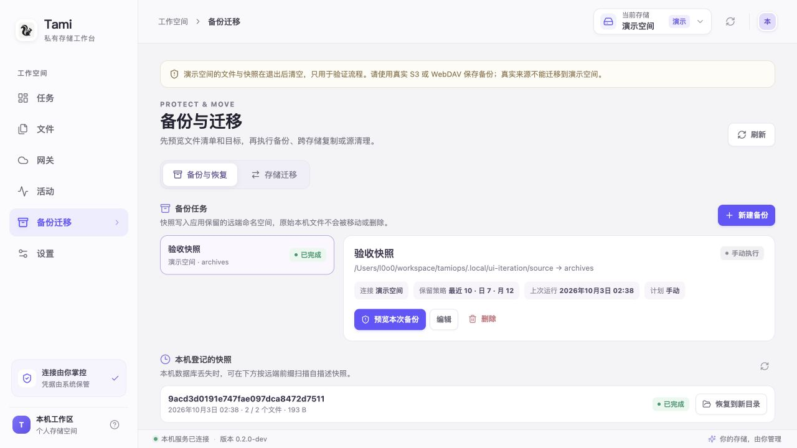

# tamiops · 私有存储工作台

Go + Wails v3 + Vue 3 / TypeScript 构建的 WebDAV / S3 客户端。当前为 **0.2.0 开发预览**：支持文件级增量同步、S3 → WebDAV 网关、备份恢复、存储迁移与按需缓存。英文产品名为 **tamiops**，使用用户提供的松鼠图标（透明背景）。

本轮功能和验证逐项列在 [实施验收清单](docs/implementation-status.md)。[产品设计](docs/product-design.md) 与 [系统架构](docs/architecture.md) 保留目标和取舍；候选能力不等于已经交付。

逐项代码复核确认的未完成细项、后续增强和待验收范围见 [剩余功能核对](docs/remaining-work.md)。

## 运行

macOS Apple Silicon 应用已构建到 `bin/tamiops.app`：

```sh
open bin/tamiops.app
```

名称更新沿用现有 `Tami` 数据目录、`io.tamiops.tami` 应用/钥匙串标识及自动启动注册文件，已有配置与凭据不做迁移。CLI 源码仍位于 `cmd/tami`，构建出的命令为 `tamiops`。更新时先退出旧实例，再启动新包；已启用登录启动时，新包启动会更新同一注册项中的可执行文件路径。

默认窗口为 **760×620**，最小支持 **620×500**；窄窗口使用紧凑导航和可滚动表单。

首次可“建立演示空间”试用。演示远端仅在内存中，退出后文件、快照都会消失；任务历史和本机恢复副本可能仍在数据目录。请使用真实 S3 或 WebDAV 保存有价值的备份。真实来源禁止迁移到演示目标。

自己的连接在“设置”添加。保存连接会验证列举权限，密码和密钥保存在系统凭据库。上传、覆盖或导出读写网关前，点击“验证读写”：程序会创建并清理随机命名的探测对象，分别检查可靠条件写入、条件删除、Range 与安全分片能力。能力不足时拒绝相应操作；重启后重新验证写入能力。

## 可用功能

| 入口 | 当前实现 |
| --- | --- |
| 存储连接 | WebDAV / S3，自定义 Endpoint、Region、Bucket、前缀、寻址方式、临时凭据、连接探测、凭据更新、带范围保护的配置编辑 |
| 文件 | 目录浏览、当前列表搜索、上传下载、创建目录、重命名、复制、移动、目录删除预览、S3 历史版本下载与条件恢复 |
| 同步 | 双向、上传、下载、双方向镜像；首次内容核验、基线、排除规则、删除预览、冲突选择本地/远端/保留双方、预计传输量与扫描历史 |
| 后台任务 | 本地变化轮询与去抖、远端检查、定时运行、持久化计划/队列、暂停/恢复/取消/重试、启动与唤醒核对 |
| 传输 | 进度、总带宽限制、读取并发、可调容量；受能力验证保护的 S3 分片上传及 Range 下载检查点恢复 |
| WebDAV 网关 | 每入口独立凭据、前缀隔离、只读/读写、密码重置、访问记录、HTTP 自检、写后缓存与任务联动；本机回环默认，局域网必须配置 TLS |
| 网关方法 | OPTIONS、PROPFIND Depth 0/1、GET/HEAD/Range、PUT、MKCOL、DELETE、COPY/MOVE、持久排他 LOCK/UNLOCK 的受限实现 |
| 恢复 | 覆盖/删除前保留副本、SHA-256 校验、另存与原路径条件恢复、保留期清理、未知提交核对和人工状态接纳 |
| 备份 | 本地目录到远端自描述快照、排除规则、定时计划、最近/每日/每月保留、恢复到新目录、本机数据库丢失后的远端发现、不完整快照清理 |
| 迁移 | WebDAV / S3 间复制，经本机中转逐文件核验；持久进度、取消/恢复；源清理单独预览并重新校验 |
| 缓存 | 按需下载、固定、系统打开、编辑后条件上传、远端版本检查、显式刷新与离线标记、脏数据保护 |
| 设置 | 暂存/恢复/缓存/单文件额度，日期/时段/网卡/电源自动执行条件，无秘密配置导入导出，脱敏诊断导出与范围统计 |
| 桌面与 CLI | 托盘、隐藏窗口后继续工作、全部同步暂停/恢复、登录启动及通知；独立 CLI 复用 Core，无需 WebView |



## 数据保护和实际边界

- 当前是**文件级增量**。本地自动发现使用约 2 秒元数据轮询与 900 毫秒去抖，执行前完整核对；远端默认每 60 秒检查，可配置间隔。没有专有块级格式、虚拟磁盘或占位文件。
- 首次同步不从“缺失”推断历史删除。扫描失败、列举不完整、远端修订变化都会阻止过期删除/覆盖。排除和符号链接跳过不作为删除传播；检测大小写、Unicode 和跨平台路径冲突。
- 写入先暂存完整内容，再在协调锁内复核并提交；下载可以并行，核心修改提交串行。并发设置控制读取准入，不表示多个远端修改同时提交。
- 远端和 SQLite 没有共同事务。提交结果不明时冻结相关资源，保留暂存与副本，活动页可核对。无法证明创建目录结果时，必须预览当前状态后人工接纳；不会自动重发未知提交。
- 移动和目录删除是多步操作，不能保证跨对象原子性。**通用 WebDAV 后端不执行可能递归误删并发新文件的空集合清理**，可能保留空目录并报告部分完成；S3 只条件删除已确认的零字节目录标记，保留并发出现的子对象。
- 网关不是完整 WebDAV 合规实现：不支持任意复杂 If 列表、持久死属性及完整 PROPPATCH。排他锁由应用内同步、文件操作和网关共享，外部直连 S3 的工具可绕过它；S3 移动也不是原子 MOVE。
- 备份保留的是逐文件核验的内容，不是活动数据库的应用一致性快照。快照位于 `<前缀>/.tamiops-backup/`，普通操作禁止写入此保留区域。迁移默认保留源，清理必须再次核验源和目标内容及修订。
- 缓存替换/淘汰会先把旧 inode 移到恢复区，使仍打开的编辑器写入能够保留。此类副本标为“可能仍被编辑”，不自动按保留期清理，需手动检查。磁盘额度耗尽时拒绝新增受保护内容。
- 默认单文件 **128 MiB**、暂存 **1 GiB**、恢复 **1 GiB / 30 天**、缓存 **512 MiB**、最大并发读取 **4**；可在设置调整，单文件不得大于暂存额度。扫描上限 **10,000 条目**，至少保留 **256 MiB** 磁盘水位。其他程序仍可能同时占用磁盘。
- 保存新文件使用不覆盖已有目标的发布方式；目标卷不支持必要的硬链接语义时明确报错。配置导入重建标识、禁用任务、清除本地根目录与凭据，需重新配置后启用。
- Windows/Linux 桌面、具体云/NAS 服务和第三方 WebDAV 应用尚未实机验证。Wails v3 仍采用固定 beta 版本；当前 macOS 包只有本机 ad-hoc 签名，没有 Developer ID 签名/公证。

## 开发与磁盘占用

固定 Go 1.25.0、Wails v3.0.0-beta.27，一个 Go module 和一份 npm 锁文件。macOS 需要 Xcode Command Line Tools；无需安装 Wails CLI。使用 `GOTOOLCHAIN=local`，避免自动下载额外 Go 工具链。

```sh
make setup       # 下载 Go 与前端依赖
make test        # Core/协议/网关/CLI 测试与前端类型检查
make check       # 竞态、静态检查、前端生产构建
make build       # 当前平台桌面包
make cli         # bin/cli/tamiops（Windows 为 tamiops.exe）
```

网络无法访问默认代理时，可只对命令设置 `GOPROXY=https://goproxy.cn`，不修改全局配置。例如 `GOPROXY=https://goproxy.cn make build`。

2026-10-03 本机实测：macOS 应用约 **23 MiB**，CLI 约 **12 MiB**，整个工作目录约 **135 MiB**（含约 93 MiB 前端依赖）。共享 Go 构建缓存约 **1.5 GiB**，模块缓存约 **430 MiB**，另行统计。已移除本轮重复的 32 MiB 中间可执行文件，未清理其他项目缓存，也未下载容器或额外工具链。无需每次清缓存重编，避免额外磁盘写入。

`make build` 在 macOS 生成 `.app`，在 Windows 生成 `.exe`，在 Linux 生成二进制与 desktop/icon 文件。三平台 CI 定义位于 `.github/workflows/test.yml`；配置存在不代表本次已经在其他系统运行。

## 无界面运行

CLI 不依赖 Wails 或图形会话。参数放在命令前；与桌面共用数据目录时必须先退出桌面，避免同时访问状态库。

```sh
bin/cli/tamiops -data-dir ./tamiops-state status
bin/cli/tamiops -data-dir ./tamiops-state export > tamiops-config.json
bin/cli/tamiops -data-dir ./tamiops-state -input tamiops-config.json import
bin/cli/tamiops -data-dir ./tamiops-state -input connection.json connection-add
bin/cli/tamiops -data-dir ./tamiops-state -input credentials.json credentials
bin/cli/tamiops -data-dir ./tamiops-state -job JOB_ID preview
bin/cli/tamiops -data-dir ./tamiops-state -verify-writes -job JOB_ID -token PREVIEW_TOKEN run
bin/cli/tamiops -data-dir ./tamiops-state -verify-writes -gateways GATEWAY_ID serve
bin/cli/tamiops -data-dir ./tamiops-state diagnostics
```

`serve` 运行调度和维护，并启动指定网关。`-verify-writes` 会实际创建/清理远端探测文件。包含删除的同步需要核对预览并提供 `-confirm-deletes`。

默认使用系统凭据库。无桌面环境可通过环境变量 `TAMIOPS_VAULT_KEY` 提供 Base64 编码的 32 字节密钥，启用本地 AES-GCM 凭据文件。兼容旧变量 `TAMI_VAULT_KEY`；两者同时设置时优先使用新变量。密钥不由应用持久化，重新运行必须使用同一个密钥；勿把密钥或凭据输入文件放入版本控制。导出配置没有密钥，不能替代凭据备份。

浏览器开发宿主：

```sh
bin/tamiops.app/Contents/MacOS/tamiops --serve --data-dir .local/browser-test
```

访问 `http://127.0.0.1:9240`。此宿主只接受指定回环 Host，API 使用同源专用请求头，不开放 CORS；没有原生目录选择器，不用于局域网部署。界面从 `frontend/dist` 读取，重建后刷新；正常桌面使用内嵌资源。

## 验证记录

2026-10-03，M4 / 32 GB macOS，使用隔离测试数据：

- **215 个 Go 测试函数**涵盖协议、Core 和网关。全量测试、竞态检测、`go vet` 通过；故障回归包含断流、分页不完整、过期预览、条件冲突、崩溃恢复、取消/关闭并发、恢复校验及缓存编辑保护。
- AWS SDK 对本机 S3 协议测试服务运行条件请求、分片、版本及网关链路；WebDAV 测试服务覆盖协议错误和能力探测。没有据此宣称真实服务商兼容。
- 浏览器交互完成同步预览/执行，2 文件快照备份/恢复（恢复字节比对一致），2 文件迁移/核验/独立源清理，以及文件缓存、自动规则和额度保存。
- 只读网关实测：PROPFIND 207、GET 200、PUT 403、匿名 GET 401；访问记录与统计匹配。此前用例覆盖越界路径和只读隔离。
- CLI 的状态、导出、导入、诊断实测；前端类型检查和生产构建通过。macOS 应用签名与 plist 校验通过，可启动进程。
- macOS 原生交互已实测目录选择、同步、配置与文件保存、默认编辑器打开与缓存写回、隐藏窗口后网关继续服务、重新打开窗口，以及 WebDAV 连接和系统钥匙串凭据重启恢复。实测发现的退出/授权等待等修复及复测状态见 [原生交互验收](docs/native-interaction-test.md)。托盘菜单、通知送达、实际注销登录和其他桌面平台仍待验收。

协议和并发代码经独立定向评审，修复后未发现此前阻断项的残留。尚无大规模目录/网络性能基线，不把演示空间的速度作为云端性能承诺。

## 代码位置

- `internal/core`：配置、凭据、SQLite、文件服务、同步、备份、迁移、缓存与恢复。
- `internal/storage`：WebDAV / S3 协议及能力探测。
- `internal/gateway`：WebDAV 转换、认证、条件/路径/锁检查。
- `internal/desktop`、`internal/systemstate`：系统文件打开、登录启动、网络及电源状态。
- `main.go`、`cmd/tami`：桌面与无界面宿主；前端通过同源 HTTP 调用 Core，文件流不经过 JSON/Base64。

[产品 Page](https://chatgpt.com/space/page_dce9a4f0943081919a68cb39f840d3ec) 与 [架构 Page](https://chatgpt.com/space/page_618914d630208191ad6c7e707adc914d) 保留此前草案，本轮实现记录以仓库文档为准。

本轮补齐情况与交互证据见[六组功能补齐与验收](docs/feature-completion-test.md)。
