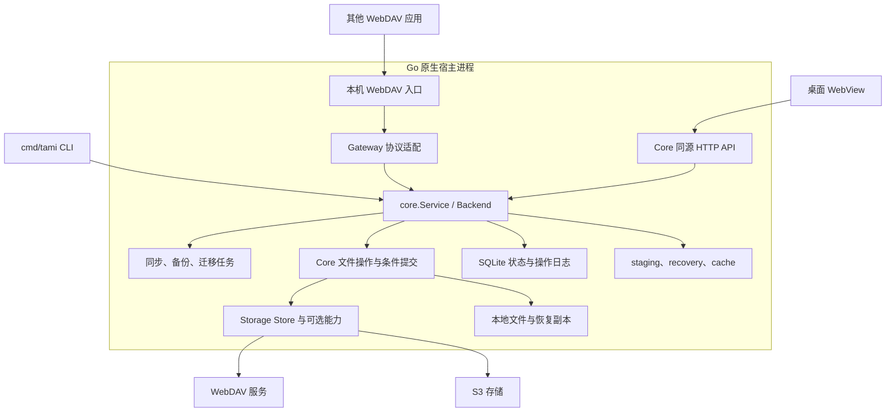
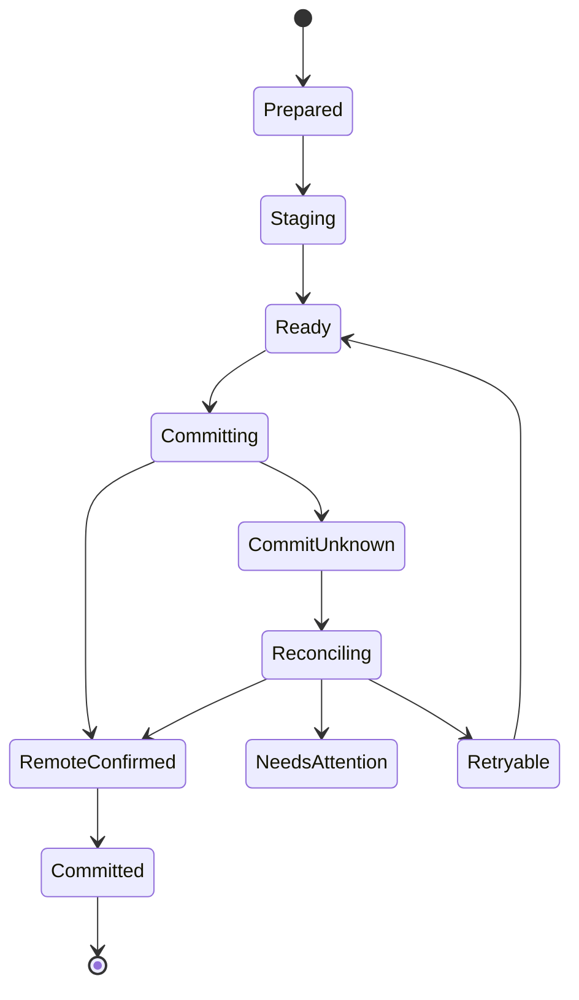
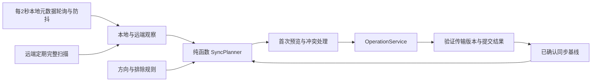
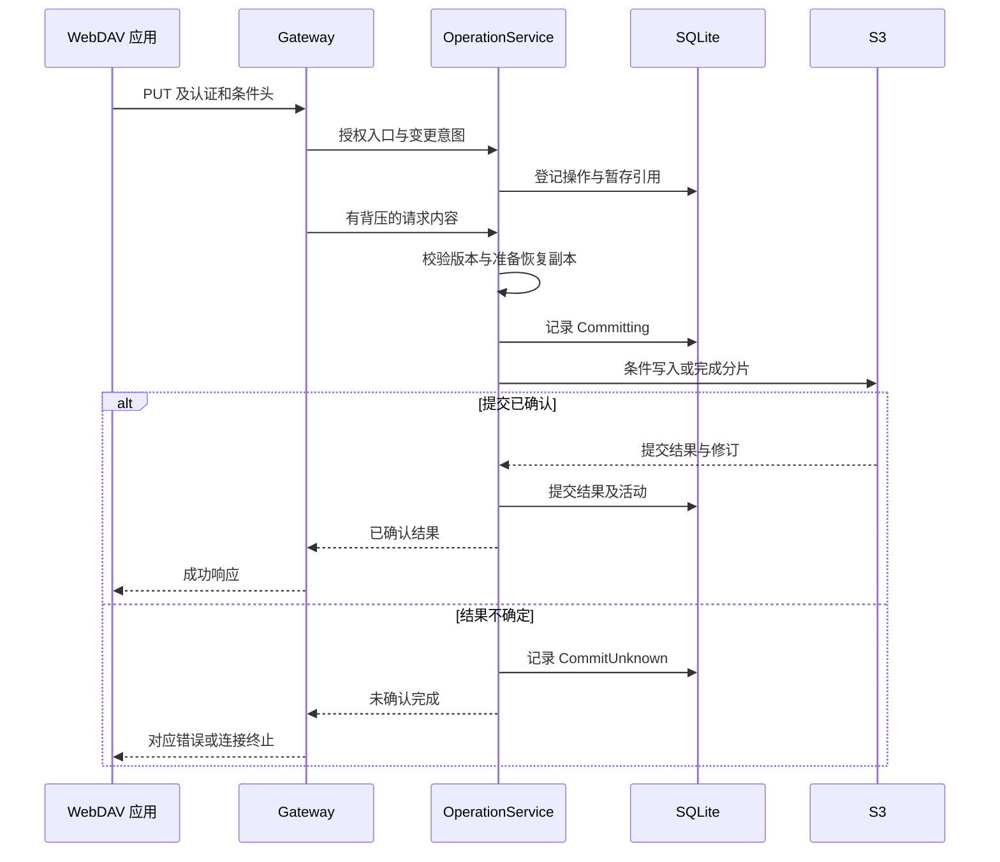

# tamiops · WebDAV 与 S3 客户端系统架构

版本：0.2 实现架构记录\
更新日期：2026 年 10 月 3 日\
状态：记录本轮代码结构、已接入能力和明确边界；各平台与外部服务验证进度见[实施状态](implementation-status.md)。产品设计中未列为已实现的候选能力仍是后续研究项。

本文说明实际代码如何承载文件同步、S3 转 WebDAV、恢复能力和桌面/CLI 运行，并保留设计约束与尚未验证事项。功能目标以[产品设计文档](product-design.md)为依据；具体实现状态以代码和[实施状态](implementation-status.md)为准。

当前实现采用 **Go + Wails + Vue 3 / TypeScript**：一个 Go module，桌面入口和独立 `cmd/tami` CLI 共用 Core；同步、备份、迁移、恢复、缓存和 WebDAV Gateway 均由 Core 的 `Service` / `Backend` 提供能力。桌面通过本机 HTTP API 查询与变更状态，文件内容不经 JSON/Base64 传输。SQLite、暂存/恢复/缓存目录和凭据库均由宿主管理。

本次选型将开发机的磁盘余量纳入约束，通过共享 Go 缓存、控制构建输出和测试数据减少重复占用。2026-10-03 的 M4/32GB macOS 测量记录为应用约 23 MiB、CLI 约 12 MiB、工作目录约 135 MiB（包含前端依赖）；这是一台开发机的构建产物/目录占用快照，不是运行内存或性能承诺。协议能力、冲突判断、条件操作和崩溃恢复规则继续作为架构的核心约束。

英文产品名为 `tamiops`，桌面包为 `tamiops.app` / `tamiops.exe`，CLI 可执行文件为 `tamiops`。名称变更保留既有 `Tami` 数据目录、`io.tamiops.tami` 应用与凭据库标识、自动启动注册文件、协议请求头和磁盘格式，避免引入隐式数据迁移。源码入口 `cmd/tami` 沿用。

## 架构决策

| 决策 | 本次方案 | 解决的问题 |
| --- | --- | --- |
| 运行方式 | Wails 原生桌面宿主；`cmd/tami` 提供无 WebView 的 CLI 与可选 `serve`；`main.go -serve` 仅用于回环开发宿主 | Core/Gateway 可复用，同时明确桌面、CLI 与开发入口的范围 |
| 依赖方向 | Desktop/CLI 组合 Core；Gateway 调用 Core 接口；Core 使用 Storage | Gateway 不直接调用 S3 SDK 或操作数据库 |
| 桌面版本 | `go.mod` 固定 Wails v3 beta；Windows/Linux 生命周期及部分 macOS 系统集成仍需验收 | beta 与应用包构建成功不等同于三平台交付验收 |
| 项目组织 | 单一 Go module；`internal/core`、`storage`、`gateway`、`desktop`、`systemstate` | 模块职责集中，但 Core 尚未拆成设计草案中的众多子包 |
| 文件操作 | `core.Service` 与 `Backend` 提供读取、条件变更、恢复和活动记录；并非独立的 `FileService` / `OperationService` 类型 | 同步、UI、CLI 和 Gateway 共用一套 Core 规则 |
| 任务调度 | 同步、备份和迁移具有持久状态；一次操作有独立结果/核对路径 | 多步任务可恢复，但跨多个远端对象不具备整体事务 |
| 同步规划 | Core 将扫描、基线、预览和执行分离；本地 Watch 当前由元数据轮询驱动 | 先确认变更，再更新基线；未实现原生递归事件监听 |
| 存储抽象 | 基础 `Store` 加可选 `RangeStore`、`VersionedStore`、`MultipartStore`、`EmptyDirectoryStore`；逐项探测能力 | 具体服务能力缺失时对应路径关闭或保守降级 |
| 恢复原则 | 记录意图、远端结果与本地提交；结果不明时先核对 | 应对远端成功而本地尚未记账的情况 |
| 数据归属 | SQLite 存状态，文件目录存内容，凭据库存可取用的秘密 | 避免凭据与文件内容混入 UI 或状态表 |
| 后续扩展 | 备份和迁移新增规划逻辑，复用文件操作与传输 | 复用已经存在的职责，不提前实现通用工作流平台 |

## 运行结构与生命周期



“一个后端宿主”指一个原生业务进程；WebView 的平台进程不包含在这个表述内。桌面 WebView 每 3 秒轮询状态快照，页面也通过 HTTP API 加载各自详情；当前没有推送式 EventFeed 或生成的 Wails 方法绑定。Gateway 按连接适配 WebDAV 或 S3。

桌面宿主初始化配置、凭据服务、数据库与 Core，并恢复未决操作状态。Gateway 由用户在界面启动，或由 CLI `-gateways <ids> serve` 显式启动；桌面不会在启动时自动恢复所有已配置入口。只有启动成功且认证/映射校验通过的入口才接收请求。数据库未就绪、凭据不可用或操作结果待核对时，相应破坏性操作会被阻断。

关闭窗口只隐藏或释放界面，Core 和 Gateway 继续运行。暂停同步只影响 JobRunner；停止网关只关闭相应入口。退出应用时先停止接收新请求和任务，再限时等待正在提交的操作；未确认结果持久化为待核对，不能标记为已回滚或已取消。网关的 http.Server.Shutdown 与 Core 的提交等待分别管理，关闭 HTTP 服务不能直接取消所有已提交操作。系统睡眠恢复后重新确认网络、远端状态与过期锁。

本项目在 `go.mod` 固定 Wails v3.0.0-beta.27，并使用该版本的托盘和窗口生命周期 API。macOS 应用包签名检查通过；已完成原生同步、文件/目录面板、编辑器缓存写回、后台网关与钥匙串凭据恢复等交互，具体修复复测及未覆盖项见[原生交互验收](native-interaction-test.md)。Windows/Linux CI 配置尚未运行。构建或签名通过不代表三平台生命周期已验收。

应用数据目录实行单宿主占用锁，重复占用时拒绝初始化，不同时打开同一运行环境执行任务。桌面先处理系统单实例通知，再初始化 Core；系统重新打开事件可显示已有窗口。原生隐藏/重新打开已验证，第二进程的聚焦请求经过同步保护并等待应用启动事件。首版的远端冲突控制仍要面对另一台电脑或外部客户端，单实例锁不提供跨设备互斥。

当前已有 `cmd/tami` 无 WebView CLI，可读取状态、导入/导出脱敏配置、补充连接凭据、查看诊断、预览/运行同步任务，并以 `serve` 启动 Core/Gateway。CLI 和桌面共享数据目录独占锁，不是供多用户并发管理的服务。`main.go -serve` 是仅回环监听的开发浏览器入口。桌面 WebView 通过同源 `/api/*` HTTP 接口工作，不直接操作存储 SDK 或数据库。

## 代码组织与依赖

当前实现目录如下。Core 的多个领域服务仍位于同一 Go package 中；文件名反映职责，不代表已按草案拆成多个子 package。

```text
go.mod                     单一 Go module
go.sum                     依赖校验记录
main.go                    Wails 桌面宿主及回环 -serve 开发入口
cmd/tami/main.go           无 WebView 的 CLI 与 serve 入口
frontend/
  src/                     Vue、TypeScript 页面和 HTTP API 客户端
internal/
  core/                    Service/Backend、HTTP API、SQLite、同步、恢复、备份、迁移、缓存和传输
  storage/                 Store、WebDAV/S3 适配及可选能力
  gateway/                 鉴权、WebDAV 方法、条件、范围与访问统计
  desktop/                 文件打开、自动启动等平台动作
  systemstate/             网络接口与电源状态
build/                     桌面打包资源
docs/                      产品设计、架构与实施状态
```

| 包域 | 可以依赖 | 不承担的职责 |
| --- | --- | --- |
| desktop / main | core、gateway、Wails | 同步算法、S3 请求、状态表维护 |
| cmd/tami | core | Wails Window、前端 WebView |
| gateway | core 的窄 Backend 接口、HTTP 与 WebDAV XML | 直接调用 S3 SDK、直接写 SQLite、第二套同步基线 |
| core | storage、数据库和系统能力 | Wails Window、DOM、前端状态 |
| storage | 协议库与 SDK | 任务调度、UI、入口鉴权、备份/恢复策略 |

Gateway 的启停由桌面宿主或 CLI 组合，Core 不反向依赖 Gateway。前端使用 `/api/*` HTTP 路由，不调用 Wails 生成绑定；Wails 负责窗口、资源嵌入、文件选择器、通知、托盘和系统事件。生产无界面入口是 `cmd/tami serve`，两种宿主复用同一个 Go module 和 Core。

## 核心接口与数据流

### 实际应用接口

当前是 `core.Service`、`core.Backend` 与 `/api/*` HTTP 路由，而非草案中独立的每领域 Service 接口：

| 接口面 | 主要责任 | 实际边界 |
| --- | --- | --- |
| Connections / settings | 连接、凭据补录、能力探测、限额与自动规则 | 能力按实际测试更新；密码/密钥不随配置导出 |
| Files / operations | 列表、stat、流式读写、目录/树操作、复制/移动及预览 | 写入经过 Core 条件检查和提交；读内容经受限流与并发准入 |
| Jobs / queue | 同步计划、持久队列、预览、执行、暂停/取消/重试 | 手动动作绕过自动执行规则，自动 sync/backup 使用规则 |
| Recovery / backup / migration | 未知操作核对、恢复预览/写回、备份快照、迁移对照和清理预览 | 多资源动作逐项提交，不是数据库与远端共同事务 |
| Gateway | 经过独立凭据授权的 WebDAV HTTP | Gateway 直接调用 Backend，不经桌面 `/api/*` 路由，也不访问 SDK、配置文件或 SQLite |
| Snapshot / activity / statistics | 状态快照、活动和有范围说明的统计 | 前端轮询和按需请求，不存在通用 EventFeed 推送 |

文件浏览和下载不经过同步规划；网关写入也不伪装成同步任务。它们共享 Core 路径、能力、条件检查、资源范围锁和活动记录。服务端旧版本当前可另存为新的本地文件；直接写回远端原路径的预览和条件恢复尚未实现。后续加入时需要作为一次新的文件写入处理。

小型结构化结果和操作编号通过 HTTP JSON 返回。文件内容在 Go 中流式传输或落入有额度的 staging，不通过 JSON/Base64 穿过 UI。SQLite 查询是任务状态的依据；WebView 状态快照默认每 3 秒更新，页面按需刷新详情。

### Job 与 Operation

Job 表示同步、备份或迁移等持续工作，包含策略、扫描周期和批次。Operation 表示一次上传、下载替换、删除、复制或移动，由同步、网关或用户文件操作发起。

设计上的统一操作服务目前由 Core 的 Backend/Service 方法承担。同步、备份、迁移会持久化计划或运行状态；Gateway 在请求范围内调用 Core 并等待真实结果。带宽限制和读取准入共享，写入提交由全局协调器串行处理；当前没有为交互请求预留单独的写提交并发槽。

暂停或取消只阻止尚未开始的副作用。接收上传和只读查询可以使用请求 context；内容完整并进入提交阶段后，操作由 Core 管理的执行组、独立提交期限和持久日志拥有，不能继续以 HTTP 请求 context 为唯一生命周期。客户端断开只结束结果等待，执行器仍须完成结果记录或进入待核对状态。不要简单启动一个脱离追踪的 goroutine；退出时必须可以枚举、等待并核对所有未决提交。

网络、扫描、摘要计算与数据库访问分别限制并发；goroutine 与 channel 都设置容量或准入规则。大文件不使用 io.ReadAll 进入内存，取消、超时和错误必须跨流传递。Go 的 GC 负责回收内存，文件句柄、连接、事务和写入错误仍需显式处理。

## 存储契约与资源身份

当前 `storage.Store` 提供 List、Stat、流式 Open、条件 Put/Delete 和 Mkdir。各适配器负责在内部完整处理分页并对不完整结果报错；调用方收到的不是公开分页游标。可选接口 `RangeStore`、`VersionedStore`、`MultipartStore` 和 `EmptyDirectoryStore` 分别暴露范围读、历史版本、可恢复 multipart、原子空目录删除。`Unsupported` 与网络错误保持区分。当前未实现一个统一原生 MOVE 或服务端 Copy 能力接口。

| 类型 | 当前契约 | 限制 |
| --- | --- | --- |
| `Config` / connection identity | WebDAV/S3 连接与映射前缀；Core 在写操作中解析连接和规范化路径 | ConnectionId 是应用标识；别名命名空间无法普遍自动归并 |
| `Entry` | 路径、文件/目录、大小、修改时间、ETag 及可选 VersionId | ETag 是不透明的条件令牌，不能一概视为摘要 |
| `Condition` | If-Match 与 If-None-Match，用于写入/删除的条件保护 | 后端能力探测不通过时，对应自动破坏性路径应拒绝或暂停 |
| `Capabilities` | ConditionalWrite、ConditionalDelete、RangeRead、MultipartConditional | 按功能探测；不代表已覆盖原生移动、完整 DAV 兼容或服务商账单能力 |
| optional interfaces | RangeStore、VersionedStore、MultipartStore、EmptyDirectoryStore | 只有接口存在且真实探测成功才使用；能力未知不等于支持 |
| operation receipt/state | Core 持久化操作 kind/state/staging/receipt 与资源范围 | 可用于核对操作；没有远端和 SQLite 共同事务，也不承诺恰好执行一次 |

Core 的 DAV 锁身份会按存储类型、规范化服务 scheme/host、Bucket 和实际后端 Key 映射，连接前缀会进入 Key。只要这些信息匹配，多个入口可命中同一锁范围；连接别名或服务端 alias 若无法识别，仍依赖远端条件写入。

当前没有提供用户声明跨域名 alias 的通用设置。相同协议类型、scheme/host 和 Bucket 会映射到相同命名空间；跨域名别名无法可靠自动识别，仍依赖远端条件保护。不能声称识别了所有外部存储别名。

S3 Key 保留大小写与原始 Unicode 内容，不对远端对象静默执行大小写折叠或 Unicode 归一化。本地路径适配负责检测平台冲突。WebDAV 入口路径只解码和规范化一次，拒绝越界形式；COPY/MOVE 的 Destination 单独校验源与目标权限。

### 操作级能力

连接能力探测会对真实对象执行隔离测试并保存能力快照。认证成功或 SDK 存在相应方法，不等于服务端行为符合要求；多服务供应商、不同 API 兼容层和账号权限仍需分别实测。

| 能力 | 影响 |
| --- | --- |
| 条件写入（普通 Put） | 是否可阻止覆盖不存在/指定版本以外的对象 |
| multipart 条件完成 | 大文件最终提交是否保留条件保护；独立探测，不替代普通 Put 能力 |
| 条件删除 | 是否能避免删除检查后又变化的目标 |
| 范围读取 | 是否能用强 ETag 固定范围并安全续传 |
| 历史版本 | 是否能枚举并读取指定版本，保留期由服务端策略决定 |
| 空目录删除 | 是否具备检查并原子删除空集合/marker 的专用原语 |

AWS 文档分别定义条件写入、条件删除和复制的源及目标条件；S3 兼容服务必须逐项验证，不能合并成一个 supports_conditional_write 布尔值。[S3 条件写入](https://docs.aws.amazon.com/AmazonS3/latest/userguide/conditional-writes.html)、[DeleteObject](https://docs.aws.amazon.com/AmazonS3/latest/API/API_DeleteObject.html)、[CopyObject](https://docs.aws.amazon.com/AmazonS3/latest/API/API_CopyObject.html)

ETag 是协议验证值，不是通用内容摘要，也不保证每次写入都变化；内容写回原样或只修改元数据时，可能观察到相同 ETag。VersionId 用于定位特定对象版本，不能比较其大小，也不等同于“当前对象仍是该版本”的比较交换。弱 ETag 不作为强条件覆盖的依据。条件请求只保护其实际比较的表示，不能泛化成对所有历史变化和元数据的检测。

自动覆盖、自动删除和网关读写模式以必要能力通过验证为前提。能力缺失时，保留浏览与读取，暂停相应自动破坏性操作并显示原因。若以后提供用户主动选择的兼容写入模式，必须单独说明竞争窗口；不能把 HEAD 后 PUT 伪装为原子条件写入。

## 并发与写入执行

### 三类保护

当前本进程提交协调器使用一个 Core 全局写互斥锁：它串行化 Core 写提交，即使提交的是不同对象，也可能互相等待；网络读取和暂存通常在取得该锁前进行。读取并发另由设置控制并有准入上限。DAV 持久锁是独立的第二层：网关锁 token 经 Storage context 传入，Core 内部写路径共用检查。第三层是远端条件操作，用于处理另一台设备或外部工具的竞争。

三者不能互相替代。内部锁不能约束外部 S3 客户端；远端对象条件也不能给整个目录提供事务。

DAV 锁支持排他 write lock、0/infinity 深度、有限期限及简单单令牌 If 条件；锁持久化，并由 Core 写入路径共同检查。网关不支持复合或 tagged If 条件、共享锁、PROPPATCH，也不宣称 class 2。锁只能约束经过本进程 Core 的写入；外部客户端直连 S3/WebDAV 服务可以绕过它。本进程的一般写提交仍是全局串行协调器，并非已经完成的细粒度祖先/子项锁管理器。

### 变更执行流程

1. 验证调用方权限、真实路径、目标能力与容量预算，登记操作意图及前置修订。
2. 接收或准备新内容，创建有容量上限的暂存文件，必要时计算完整性摘要。
3. 获取资源锁，重新读取必要的源与目标状态；过期计划转为冲突或重新规划。
4. 完成保护策略要求的旧内容保留，记录其版本和恢复位置；失败时默认暂停该破坏性操作。提交前再次检查入口权限和配置代次，停用或撤权不能只影响新建请求。
5. 持久化即将提交的状态，然后发出携带前置条件的远端操作或执行本地安全替换。
6. 解析完整响应并记录 CommitReceipt；网络超时或响应不明确时进入结果未知状态。
7. 在本地事务中更新操作结果、受影响观察结果、同步基线的适用部分和活动记录。
8. 释放资源锁，记录结果与活动。网关只有在远端已确认且必要结果记录成功后返回成功。主动标记相关缓存过期并触发同步重查仍为待补项，当前依赖后续扫描或显式缓存检查。

上传和慢下载的内容接收/网络读取不长时间持有全局提交锁，暂存通过共享 reservation 控制额度；提交前重新验证目标。Gateway 有并发槽、请求期限和暂存额度。成功响应依赖真实远端提交结果，不能在后台队列尚未执行时先返回成功。

保护旧版本时，副本必须对应即将覆盖的版本。使用版本读取或条件读取固定内容；源在读取过程中变化则重试或报冲突。无法确认副本完整时，不得标记为可恢复。

本地文件也有外部编辑竞争，进程锁无法阻止编辑器写入。下载采用临时文件、提交前复核以及可保留被替换内容的平台文件操作；“检查后 rename”本身不是跨平台文件 CAS。首批平台必须验证替换时保留旧内容的方案；无法满足保护条件时保存为冲突文件，不自动覆盖。打开文件句柄与符号链接处理也应避免路径检查后的目标替换。

## 操作状态与崩溃恢复



状态图展示主路径。前置条件失败可以转为 Conflict；提交前的取消可以转为 Cancelled；确定未产生副作用的错误可按策略重试。Committed 表示副作用与本地必要状态均已记录，不代表一个外部客户端一定收到响应。

SQLite 与 S3 或本地文件系统之间没有共同事务。设计目标是可核对、可恢复，并避免盲目重复副作用，不承诺端到端恰好执行一次。

| 中断位置 | 启动后的处理 |
| --- | --- |
| 意图已记录，尚未发起写入 | 验证暂存与版本后可重新执行 |
| 上传了部分分片，尚未完成提交 | 核对上传标识与分片，恢复或清理，不能当作文件已保存 |
| 提交已经发出，结果未收到 | 按目标修订、可用校验信息和操作证据核对，不能直接重发覆盖 |
| 远端成功，本地事务尚未提交 | 找回对应结果并补记；证据不足时转待处理，不覆盖当前新版本 |
| 本地已提交，HTTP 响应丢失 | 重试请求按当前条件重新判断，不能仅凭相同路径当作同一请求 |
| 复制成功，删除源失败 | 保留两份并显示部分完成；只有确认源未变化才允许继续删除 |

S3 对象元数据可在适用时记录操作编号，并结合返回修订、内容摘要和日志进行恢复核对；单独的操作编号、存在性、大小或修改时间都不是充分证据。WebDAV 服务不能假设支持自定义元数据。若对象已经被外部修改且无法证明本操作的结果，保留当前数据并要求处理。

同一资源存在未核对的提交时，阻止新的破坏性操作越过它；不阻塞整个应用的无关资源。只有在能证明之前没有提交或重新规划安全的情况下，Retryable 才能重新进入执行。

SDK 与任务共用重试次数和时间预算。读取及已证明未产生副作用的失败可以自动重试；写入、分片完成、复制和删除只有在已证明可安全重放时才启用 SDK 自动重试。可能已经提交的错误必须交给 Core 核对，不能仅凭请求方法幂等或携带 If-Match 就自动重发。限制重试次数不能替代这一判断。删除超时后目标若被重建，旧操作不能再删除新对象；删除历史 VersionId 与对当前 Key 执行删除的语义也必须区分。

## 同步引擎

同步包含观察、规划和执行三个阶段，数据模型保持分离：Observation 表示这次实际看到的状态，Baseline 表示上次已经确认的对应状态，Plan 表示准备执行的动作。不能把一次扫描结果直接写成成功同步基线。



当前没有使用 fsnotify 原生递归事件。任务 Watch 每 2 秒计算本地目录元数据指纹，只将路径、大小、修改时间和模式用于发现候选变化；变化后等待 900 毫秒防抖，再进行内容哈希和远端核对。远端至少每 60 秒进行一次完整扫描；配置的任务周期更长时按该周期完整核对。应用唤醒可触发重新核对。远端列表必须完整，否则不生成基于缺失项的删除候选；完整分页仍不是跨时间原子快照，删除前还要验证版本。

两个非空目录首次建立关系时没有历史删除依据。同名内容无法确认一致则进入冲突；不凭较新的修改时间自动覆盖。方向、排除规则和任务范围也具有版本，规则改变会使旧计划失效，不等同于真实文件删除。

基线以任务和相对路径为单位，记录本地指纹、远端修订及已知内容证据。一次上传完成后若本地再次变化，只能记录实际上传的内容状态，并将当前本地标记待扫描；不能把新修改视为已上传。网关写入不推进同步基线。Core 把提交回执、相关缓存过期标记和 `sync_dirty` 任务标记放在同一事务内，按物理资源范围覆盖连接别名。调度器按标记重新预览；自动任务遵守执行规则，手动任务只提示，暂停任务保留标记。核对按标记 token 确认，期间新变更不会被旧扫描吞掉。绕过本应用的远端变更仍依赖周期扫描。

重命名检测首版是可选优化。证据不充分时按新增和删除的规则处理，仍需删除保护；不能通过弱相似性推断移动后直接删掉源文件。跨平台路径冲突在规划阶段产生明确错误。

## WebDAV 网关

Gateway 负责 HTTP 和 WebDAV 行为，Core 负责文件语义。网关不创建第二套 S3 客户端、版本缓存或恢复策略。

### 请求处理



Core 将入口身份转换为受约束的范围对象，所有读取、写入和 Destination 映射都受其约束。只读入口不仅隐藏按钮，还拒绝所有写入方法。首版监听回环地址并要求认证；网关没有供网页直接调用的通配 CORS 控制接口。

GET 和 HEAD 使用流式或范围读取；Gateway 支持一个有效 byte range，并按 If-Range 与实体条件决定返回范围或完整表示，不承诺 multipart/byteranges。Range 只有在后端能力已探测且强 ETag 可用于固定版本时才开放。PROPFIND 内部分页消费存储列表并生成多状态响应；对远端不完整列举或缺失根/子项属性 fail closed，不把部分目录呈现为完整列表。

### HTTP 方法与协议边界

当前 Gateway 由 `net/http` 实现方法分派、请求体暂存、条件解析与 DAV XML，不依赖 `golang.org/x/net/webdav` 的文件系统写接口。PUT 由 Core 接收并提交完整流；只有实际远端写入结果成功才回复成功。OPTIONS 按是否只读及 Backend 是否提供可选接口生成 `Allow`，只声明 DAV class 1。

COPY/MOVE 的目标通过 `Destination` 单独解析，验证同源、映射前缀、规范化路径及源/目标操作权限；编码越界或复合 `If` 条件明确拒绝。简单单锁令牌会经 context 传给 Core 共享写保护。`PROPPATCH` 返回 501；不支持共享锁、复合/Tagged If 条件或所有 class 2 语义，不能因为 LOCK/UNLOCK 可用就声称 class 2。具体状态码和目标应用互操作仍需按客户端版本验收。[WebDAV 标准](https://www.rfc-editor.org/rfc/rfc4918)

### 移动和递归操作

S3 MOVE 拆成带依赖关系的子操作：冻结本进程可控制的源与目标范围、建立操作清单、保护目标、固定源版本复制、验证目标提交、条件删除未变化的源，最后再次核对范围。外部工具仍可在此期间新增或修改对象，多对象操作不具有整体原子性。新出现的对象不加入旧清单，不执行清单外的前缀清空，也不通过无条件反向复制来“回滚”他人的新修改。

如果没有可靠的源保护、目标保护或条件删除能力，拒绝受影响的移动或保留复制结果而不删除源，不能静默降级为无条件删除。HTTP 层按规范呈现部分失败，桌面活动记录提供详细项。

RFC 4918 对单文件 MOVE 有原子性要求，而普通 S3 的两个 Key 之间复制再删除不能对外部直连客户端提供同等保证。目录成员失败可以按规范返回多状态响应，但不能据此声称单文件移动也满足完整语义。首版按实际方法与客户端矩阵声明兼容性：严格要求原子 MOVE 的调用方暂不兼容，受限移动行为单独标注。真正补齐这一保证需要后端原生能力或受控命名空间间接层，会改变普通对象互通的取舍。[WebDAV MOVE 规范](https://www.rfc-editor.org/rfc/rfc4918)

空目录删除单独要求 `EmptyDirectoryStore` 原子原语。Memory 在自身互斥区内检查和删除空目录；S3 只在 marker 确为零字节并以其 ETag 条件删除时清理。通用 WebDAV 没有等价的非递归原子接口，因此远端空集合清理保守拒绝；树删除若已删完文件但不能清除空集合，会保留集合并报告部分完成，不用再次递归清空来掩盖结果。

CopyObject 等操作必须完整解析服务响应；HTTP 200 本身不足以证明复制成功。[S3 CopyObject 响应说明](https://docs.aws.amazon.com/AmazonS3/latest/API/API_CopyObject.html)

### 锁与属性

已实现锁记录包含 token、所有者、资源范围、0/infinity 深度和过期时间，并持久化到 SQLite；只允许最长一小时的排他 write lock。LOCK、刷新和 UNLOCK 由 Core 提供，所有经过 Core 的写方法复用锁检查；进程外直接访问底层存储不受这些锁约束。实现是受限子集，不等同 class 2 兼容。

PROPPATCH 当前明确不支持，不创建本地死属性表，也不会伪装成功。PROPFIND 返回实现范围内的资源属性和支持的锁发现属性；不支持的属性请求不被解释为可写属性。

## 持久化与文件目录

当前使用 `database/sql` + `mattn/go-sqlite3`，启动时配置 WAL、FULL 同步和忙等待，并将 SQLite 最大连接数设为 1；Core 写提交还由全局互斥锁串行化。事务应短小，网络 I/O 不在持有数据库事务时执行。CGO 与平台构建仍需相应工具链/CI 验收。

mattn/go-sqlite3 依赖 CGO 和 C 编译工具，不能承诺只设置 GOOS / GOARCH 就能完成桌面交叉编译。当前 Go race、vet 测试通过，但 Windows/Linux CI 配置尚未运行。[go-sqlite3 构建要求](https://github.com/mattn/go-sqlite3#installation)

当前 SQLite DSN 使用 WAL、FULL 同步和 5 秒 busy timeout。SQLite 与远端对象操作仍没有共同事务；FULL 设置不消除文件系统/硬件本身的持久性限制。[SQLite WAL](https://www.sqlite.org/wal.html)

| 数据集合 | 首版主要内容与约束 |
| --- | --- |
| `settings` / application config | 连接、同步任务、网关、规则和偏好设置的序列化配置；密码由凭据库按引用保存 |
| `operations`, `operation_resources` | 文件变更意图、状态、receipt/staging 引用及操作涉及的路径范围 |
| `baseline`, `sync_plans`, `sync_queue` | 同步基线、预览计划及持久队列进度 |
| `dav_locks` | Core 共享检查的 WebDAV 排他锁及期限 |
| `backup_jobs`, `backup_snapshots`, `backup_items` | 备份策略、快照元数据、每文件 hash/etag/状态 |
| `migration_jobs`, `migration_runs`, `migration_items` | 源目标映射、预览和核验/清理所需逐项证据 |
| `downloads`, `multipart_uploads` | 下载检查点及 multipart 上传标识、状态与持久分片数据 |
| `cache_entries` | 缓存 ETag、SHA-256、固定状态、远端变化及最近检查状态 |
| `gateway_access`, `statistics`, `activity` | 有界网关请求记录、按作用域统计与可读活动 |

上述表已在当前 schema 中实现；数据库版本升级通过 Core 启动迁移处理。没有实现可互通的专有内容分块表，也没有 PROPPATCH 死属性表。

```text
应用数据目录/
  state.db         SQLite WAL 数据库
  staging/        未提交或等待核对的内容
  recovery/       应用保留的旧内容和恢复项
  cache/          有额度、可重建的按需文件缓存
```

这些目录放在应用专用位置，不能落入用户同步根目录或导出的 WebDAV 路径。文件内容不存入 SQLite BLOB。恢复副本的跨设备可用性取决于存储位置，首版本地副本仅承诺在本设备保留。

文件与数据库同样没有共同事务。先写入独立临时文件、校验并按平台要求持久化，再登记为可用引用；启动扫描将文件和记录核对。数据库里仅有一条 ready 记录不能证明内容仍存在。清理器只删除不被未决操作、用户保留策略或恢复记录引用的内容，并有容量预留，不能用缓存淘汰逻辑清除待提交数据。

远端密钥和可取回的网关密码使用系统凭据库；认证校验采用适当的密码验证材料，不在操作日志中记录明文。系统凭据库锁定或不可用时暂停相关连接，不能回退到配置文件明文存储。

## 当前技术选型

依赖版本由 `go.mod`、`go.sum` 和前端 lockfile 固定。本表描述当前选择，不承诺未经测量的安装包或内存数值。

| 范围 | 建议 | 取舍 |
| --- | --- | --- |
| 桌面宿主 | Wails v3.0.0-beta.27 | 使用原生托盘、窗口和资源嵌入 API；系统生命周期需分平台验收 |
| 前端 | Vue 3、TypeScript、Vite | 页面只表达任务和文件状态，避免业务逻辑下沉到组件 |
| 并发执行 | 有界 goroutine、channel、context、可配置读取准入与 Core 全局写提交互斥 | 写提交当前串行；慢传输在提交锁外执行并通过 staging reservation 控额 |
| 数据库 | database/sql + mattn/go-sqlite3 | SQLite 单连接、WAL/FULL；CGO 构建按平台 CI 验收 |
| S3 客户端 | AWS SDK for Go v2 的 S3 模块 | 保留条件操作、分片和版本结果；只引入实际使用的模块 |
| WebDAV 客户端 | net/http + encoding/xml | 复用 Transport，按 XML 命名空间解析，限制响应与资源占用 |
| WebDAV 服务 | net/http 自定义 Gateway | 明确处理 PUT 条件、Range、Destination、可选锁及不支持的方法，不宣称 class 2 |
| 本地 Watch | 2 秒目录元数据轮询 + 900 毫秒防抖 | 不依赖 fsnotify，不跟踪文件内容块 |
| 本机环境 | `systemstate` 查询接口 | 时间/星期/网络/电源规则用于自动执行；环境未知按限制规则处理 |

本仓库 `go.mod` 当前使用 Go 1.25.0 与固定 Wails beta。macOS 应用已构建并通过签名检查；Windows/Linux CI 尚未运行。不要根据 SDK 存在或本机能够构建推断跨平台兼容性。[Wails 安装要求](https://v3.wails.io/getting-started/installation/)

相关官方资料：[AWS SDK for Go v2](https://docs.aws.amazon.com/sdk-for-go/v2/developer-guide/welcome.html)、[net/http](https://pkg.go.dev/net/http)、[encoding/xml](https://pkg.go.dev/encoding/xml)、[log/slog](https://pkg.go.dev/log/slog)。实际兼容性仍需具体服务及客户端验证。

## 开发磁盘预算

磁盘管理同时覆盖工具缓存和测试运行数据；不能只测最终可执行文件。以下额度是原型阶段的初始管理目标，超过时先报告、检查来源并调整，不是已测量结果，也不是 Go 工具自带的硬限制。

| 范围 | 初始管理目标 | 管理方式 |
| --- | --- | --- |
| 项目可再生成内容 | 2 GiB，覆盖 node_modules、前端输出、桌面产物与打包临时输出 | 保留一个当前平台开发输出，发布归档移交 CI；构建配置、图标和签名配置不属于可清理产物 |
| 日常测试数据 | 512 MiB | 测试按需生成，正常结束清理；失败保留的样本有清单和上限 |
| 原型运行暂存 | 1 GiB，全任务共享预留 | 上传前预估或逐块预留，超限拒绝新内容；大文件专项测试单独增加预算并在结束后核对 |
| 原型恢复副本、缓存 | 分别设置额度，首次原型合计目标 1 GiB | 缓存按需使用并受额度约束；恢复副本按保留策略维护；未决操作和 MutableCache 不自动淘汰 |
| Go 工具链、模块与构建缓存 | 基线和每次依赖变更后测量，单独报告 | 一套活动工具链、默认共享缓存，避免在各项目或分支重复创建私有副本 |

Go 使用 GOCACHE 保存可复用构建结果，会定期清理近期未使用的缓存，但不提供项目可直接配置的硬容量上限；GOMODCACHE 保存下载的模块，需要单独统计，不能假设会随构建缓存一起回收。保持一个 module 和统一构建参数有利于复用，但不能保证所有平台、编译选项或版本共用同一份产物。日常不在每次构建后运行 go clean -cache 或 -modcache，以免下一轮重新编译、下载和写盘；空间需要回收时先定位已过期产物与测试数据。[Go 构建缓存与环境变量](https://pkg.go.dev/cmd/go#hdr-Build_and_test_caching)

工具链版本需要显式规划，避免一次 latest 安装隐式下载多套工具链。前端保持一个包管理器和锁文件，避免同时维护 npm、pnpm 等重复依赖目录。macOS 本地只构建当前架构；Windows 和 Linux 产物由平台 CI 生成，日常协议验证优先使用小型测试服务和小数据集，大规模与故障测试按需运行。

运行时对磁盘剩余空间另设保护水位，容量预算和物理剩余空间都通过才接收新的暂存。开发模式只允许清理已标识的测试目录；产品 staging 中尚未核对的内容必须保留，即使达到额度也不能当普通缓存删除。空间占满时暂停相关写入并说明原因。

## 已实现的扩展与研究候选

| 能力 | 当前实现 | 保留的边界 |
| --- | --- | --- |
| 服务端历史版本 | S3 历史版本可列出、另存本地，并经预览条件恢复到远端原路径 | 只在服务端版本接口和权限可用时提供；远端恢复固定 VersionId、当前 ETag 或不存在条件，与应用保留副本的条件恢复区分 |
| 定时备份 | Core 持久化备份任务、逐项 SHA-256 清单、保留策略、远端快照发现和恢复 | 不保证源文件夹在同一时刻的应用一致快照 |
| 存储迁移 | 预览源/目标冲突，逐项核验内容，保留源，单独预览后清理 | 跨对象复制/清理不原子；失败后结果可能是部分完成 |
| 读取缓存 | 版本/摘要关联、固定、编辑回传、离线/远端变化标记、受保护刷新和恢复区 | 不是虚拟盘/占位文件；MutableCache 保留旧 inode，不自动清理 |
| CLI | `cmd/tami` 复用 Core，可运行状态、配置、连接、诊断、同步及 Gateway serve 命令 | 单数据目录独占，不是多用户团队服务 |
| 自动执行规则 | 时间、星期、活动网络和交流电规则接入自动同步/备份调度 | 手动动作绕过；OnlyOnAC 且电源状态未知时暂停自动操作 |
| 块级增量 | 未实现 | 需独立设计专有块库、完整性清单和普通对象互通代价 |
| 虚拟磁盘/占位文件 | 未实现 | 依赖平台文件系统集成，列为研究候选 |
| 团队权限、多用户、移动端、统一挂载视图 | 未实现 | 不属于本轮单用户桌面交付，分别评估产品与平台成本 |

Demo 用于隔离演示：退出进程后远端演示对象不保留；它不能替代真实备份目标或存储迁移目标。

## 验证状态与剩余门槛

主代理报告 Go 测试完整通过，`go test -race ./internal/... ./cmd/tami`、`go vet ./internal/... ./cmd/tami` 和前端生产构建通过，macOS 应用签名检查通过。macOS 已完成多项原生交互，系统通知、托盘菜单及修复复测边界详见[原生交互验收](native-interaction-test.md)。Windows/Linux CI 配置、真实云/NAS 和第三方 WebDAV 客户端均尚未验证；详见[实施状态](implementation-status.md)。

核心测试分为三类。纯规划测试验证“输入观察与基线产生什么动作”；协议契约测试针对实际服务验证条件语义；故障注入在提交前后、数据库记账前后、复制与删除之间主动中断，验证恢复结果。不能只用内存模拟服务就宣布某个 S3 服务或 WebDAV 应用兼容。

重点竞争场景包括：两个入口映射同一个 Key；父目录删除与子文件上传并发；同步与网关同时覆盖；另一台设备在复制后修改源；客户端未收到成功响应后重试；上传中本地继续保存；远端成功但 SQLite 提交失败；本地编辑器在下载替换前后修改文件。网关还要验证请求体中断后不会提交残缺对象、提交期间取消请求不会丢失结果、Close / Stat 失败不会被误记为成功，以及响应 ETag 来自实际提交版本。

性能基准仍需覆盖空闲运行、大量小文件、单个大文件、大目录 PROPFIND、并行网关与同步及长时间运行后的队列/WAL。当前全局写提交串行是明确的扩展限制；须在真实负载基准后再考虑细粒度提交并发。队列、暂存、历史和日志需持续监控其额度与超限行为；不在没有基准数据时填写性能承诺。

## 剩余验证问题

1. 目标 WebDAV 客户端对本轮排他锁、单令牌 If、范围下载、Destination 编码和多步 MOVE 的实际互操作情况；PROPPATCH/复杂 If 仍明确不支持。
2. 各 S3 兼容服务是否正确遵守普通写、multipart 完成和条件删除能力探测；未知服务的兼容性逐项确认。
3. Windows、Linux 和 macOS 的托盘、关闭窗口、主动退出、睡眠唤醒、凭据库、自动启动和文件打开行为。
4. 应用包大小、空闲资源、大目录和大量小文件性能及运行时额度的真实测量；现有预算是管理目标，不是实测承诺。
5. 备份源在运行期间持续变化、WebDAV 无法原子清除空目录、远端迁移清理部分失败等情况下的用户可恢复体验。

只有对应环境的协议或桌面验收通过后，才能把“代码已实现”提升为“该服务/客户端/平台已验证兼容”；对象存储上的多步操作仍不构成强一致全局事务。
