# 六组功能补齐与验收

日期：2026-10-03。沿用 Go + Wails + Vue 技术栈，不新增运行时依赖。此次补齐此前差距清单中的六组功能；远期能力与外部兼容性范围见[剩余功能核对](remaining-work.md)。

## 已完成

| 功能 | 用户入口与实际行为 |
| --- | --- |
| 修改联动 | 网关、文件操作及版本恢复共用提交协调器。操作回执与缓存过期、同步待核对标记原子落盘；按相同服务和路径范围覆盖连接别名。手动任务只提示，暂停期间保留标记，自动任务继续遵守规则 |
| 同步容量和扫描记录 | 预览展示每文件大小及预计上传/下载总量；记录扫描范围、时间、结果、数量和错误。任务显示扫描中、最近摘要和需处理状态；最近记录支持展开与刷新，最多每任务 100 条、全局 500 条 |
| 网关自检 | 在已启动网关卡点击“自检”，通过实际 HTTP 入口验证认证、创建、读取、覆盖、移动、删除与清理；只读入口检查读取及拒写，异常残留单独报告 |
| 连接编辑 | 设置 → 存储连接 → 编辑配置 → 验证更改 → 确认保存。保留连接编号和留空凭据；真正改变范围/账号空间时先检查引用，暂停关联任务并清除旧计划和基线。未清理的历史备份快照也会阻止重映射 |
| S3 历史版本恢复 | 文件 → 版本历史 → 恢复到远端 → 预览 → 确认恢复到原路径。绑定版本编号与目标当前版本；并发修改、重复提交、过期预览均拒绝；被替换内容受恢复区保护 |
| 不完整备份清理 | 备份与恢复 → 部分/失败快照 → 预览清理 → 确认具体对象。展示路径、数量和容量；完整快照、活动任务和未决提交受保护。中断对象按内容核验，提交日志用于恢复缺失的清理回执；完成后禁止继续恢复已清理快照 |

## 自动验证

- `make check` 通过：Go 竞态测试、静态检查以及 Vue/TypeScript 检查与前端生产构建。
- 最后修正 WebDAV 名称编辑中的无关 S3 参数后，额外执行连接编辑、范围变更和凭据路径的定向 `go test -race`，通过。
- 当前共有 **215 个 Go 测试函数**：六组功能补齐新增 33 个，解锁后的原生补测再新增 3 个。新回归包括缓存下载期间远端变更、别名/相邻路径、脏标记版本、暂停中的扫描、手动遗留队列、扫描记录容量与重启、预览过期、条件恢复与并发恢复、备份残留和清理中断恢复。
- `make build cli` 通过；macOS `.app` 约 22 MiB，CLI 约 12 MiB。`codesign --verify --deep --strict` 和 `plutil -lint` 通过。仍是 ad-hoc 签名。
- macOS 链接器出现既有 `LC_DYSYMTAB` 和重复 `-lobjc` 警告，命令退出成功；未将这些警告当作跨平台兼容验证。

## 交互验证

使用 Computer Use 操作本机浏览器，后端为独立临时数据目录和回环 HTTP 服务。没有使用用户的真实云存储凭据或数据。WebDAV 编辑测试连接到真实启动的本机网关；历史版本测试使用隔离的版本存储夹具，不能替代真实 S3 厂商验收。

1. 同步预览显示上传 28 B、下载 0 B，执行成功；写后重新核对没有待同步内容。扫描历史保留上传记录及后续核对结果，“刷新”不会关闭面板。
2. 网关自检完整通过认证、创建、读取、覆盖、移动、删除与残留核对。
3. WebDAV 连接改名经验证和确认保存成功，留空密码保留已有值，条件写入/删除/范围读取能力正确显示。仅改名称保持原同步范围。
4. 将历史版本文件从当前 15 B 恢复为指定的 11 B，界面刷新并报告被替换内容已保留。
5. 一个实际部分失败的备份生成清理预览：2 个对象、627 B。确认后状态变为“远端残余已清理”，恢复按钮禁用；本机来源文件内容仍然存在。
6. 在 760×620 和最小 620×500 窗口检查新增流程；清理弹窗按钮可见，没有水平溢出。浏览器无前端 warning/error。验收页已关闭、尺寸覆盖已还原，临时测试服务已停止。

### 本轮交互测试发现并修复

- 连接探测持有全局写锁，再访问本应用网关，造成自锁。探测移出锁，提交前重新检查配置、凭据、预览和依赖；增加同 Service 网关端到端回归。
- 网关 PUT 未返回已提交对象的 ETag，导致本机 WebDAV 客户端能力检测失败。现在直接返回提交回执中的 ETag 和修改时间。
- WebDAV 改名表单意外填入 S3 默认 Region，导致误报范围变化。表单与范围判断均按协议区分。
- 补齐备份清理弹窗、持久错误/部分结果与重新预览入口；已清理快照的恢复入口禁用。

### 界面记录

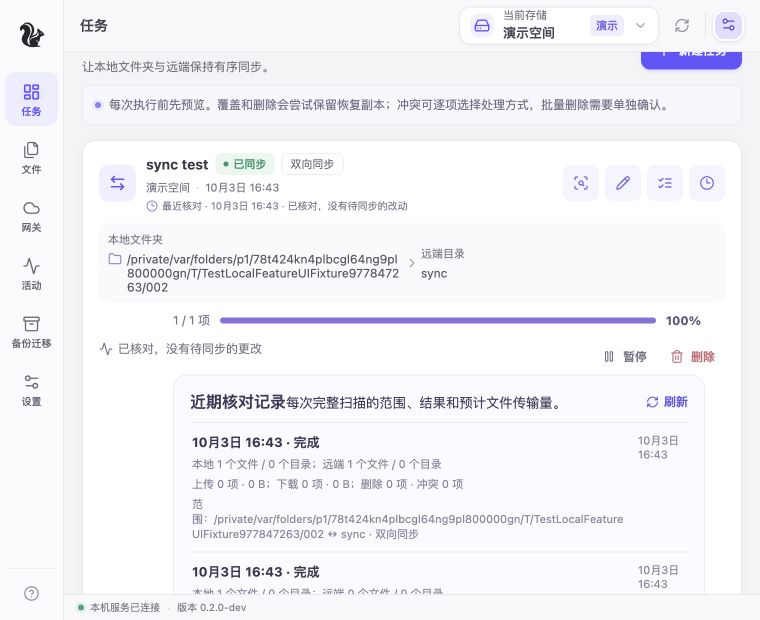

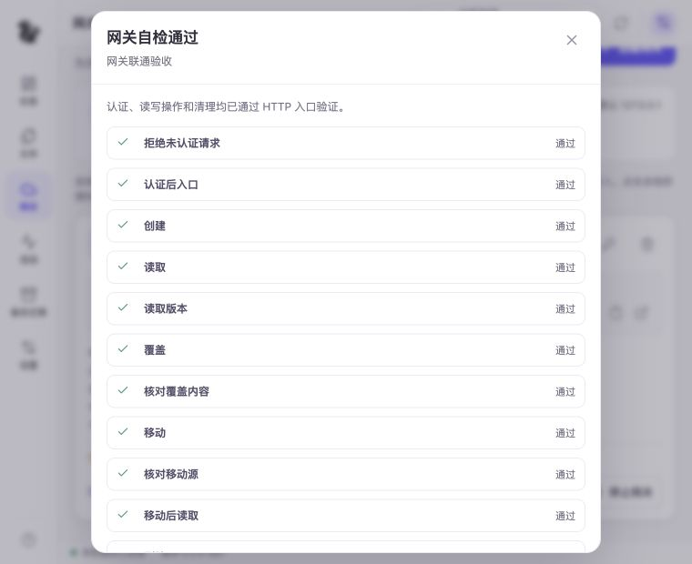

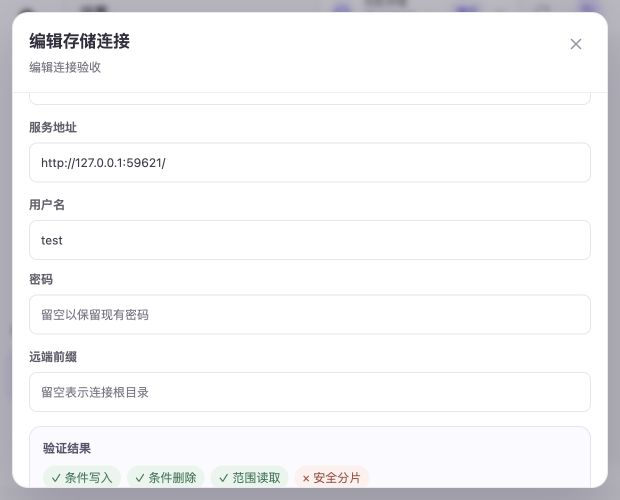

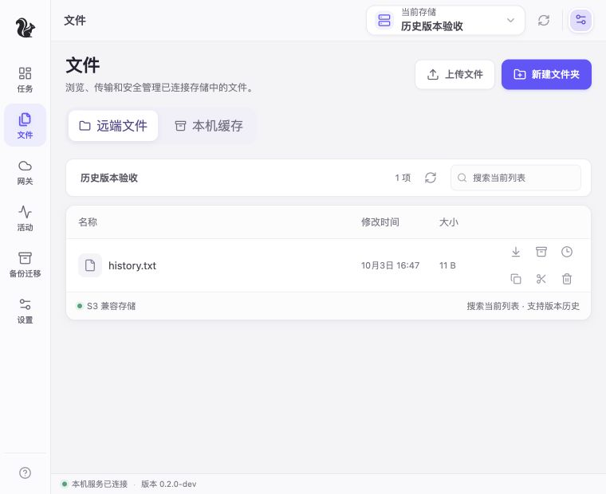

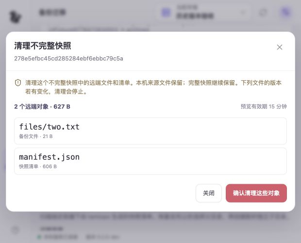

## 验证边界

此前因 Mac 锁屏而未完成的原生补测，在解锁后继续进行。使用实际 `bin/tamiops.app`（Wails macOS WebView）、隔离目录、回环 WebDAV 和 S3 HTTP 协议夹具。补测证据及修复见下方记录；本机协议夹具不能替代真实存储厂商验收。

Windows/Linux 实机、真实 S3/WebDAV/NAS、第三方应用兼容矩阵，以及正式签名与公证仍待后续验收。此前原生测试记录见[原生交互验收](native-interaction-test.md)。

## 解锁后的 macOS 原生补测

2026-10-03 17:15–17:34，Computer Use 操作实际 macOS 应用；默认内容区为 760×620。先退出无连接、无任务的旧实例，再使用独立测试目录启动新版。未使用真实云账号或个人文件。620×500 的布局证据仍来自上面的浏览器测试，本次不追加原生最小尺寸通过声明。

| 场景 | 原生操作与核验结果 |
| --- | --- |
| 目录选择与同步 | macOS 目录选择器定位独立测试目录，选择后正确回填；预览上传 24 B、下载 262 B，执行完成 3 个文件及 1 个目录，随后核对为零变化 |
| 扫描记录与暂停保护 | 最近核对记录展开及刷新正常；暂停后可以预览，显示暂停说明并禁用执行按钮；Escape 能关闭弹窗 |
| 连接编辑 | S3、WebDAV 分别只改名称，密码/密钥留空，验证提示范围不变，确认保存成功；重启后 S3 名称与凭据保留，可以重新验证能力 |
| 版本恢复与缓存联动 | 通过真实 S3 HTTP 适配器和本机协议夹具，将 `history.txt` 从 15 B 恢复到指定 11 B 版本；HTTP 读取确认为 `old version`，恢复区 `.data` 文件确实保存原来的 `current version`。缓存建立后再次恢复，界面显示“远端已变化” |
| S3 转 WebDAV | 原生应用启动映射至 S3 夹具的读写网关，自检的认证、创建、读取、覆盖、移动、删除、清理全部通过；另一个 WebDAV 连接回连这个同进程网关，点击“验证读写”正常完成 |
| 不完整备份清理 | HTTP 412 明确拒绝一个文件，生成 1 成功、1 失败的真实部分备份。未验证条件删除时预览拒绝执行；验证后预览准确显示 `files/two.txt` 28 B 与清单 618 B，共 646 B，确认后状态为“远端残余已清理”、恢复按钮禁用。SQLite 状态为 `cleaned` 并保留两条删除回执；来源的 28 B 与 34 B 文件内容均未被修改 |
| 未知结果保护 | 另一个 HTTP 507 故障夹具留下 `uncertain` 上传。连接编辑被阻止，点击核对后若证据仍不足则继续保留未知状态；没有绕过保护或自动重放 |

### 本次补修与回归

`TestConnection` 的常规读写验证原先仍持有全局写锁进行网络探测；当 WebDAV 连接回连本进程网关时，网关提交也要获取这把锁，可能造成相互等待。现在先取得配置与凭据快照，在锁外探测，再重新加锁确认连接、配置与凭据未变后写入能力结果。过时结果被拒绝，demo 继续使用原来的内存实例。

新增 3 个回归覆盖同进程网关、探测期间配置变化及凭据变化；定向测试和整个 `internal/core` 包的 `go test -race -count=1` 均通过。`go vet ./internal/core`、`make build cli`、前端类型检查/生产构建、macOS 签名与 plist 检查通过。独立代码评审未发现此修复的阻塞问题，且最后构建已在原生 UI 中完成同进程回连实测。应用包约 22 MiB，仍无新增依赖。

测试结束后正常退出测试实例，关闭三个回环夹具服务，删除本轮测试数据及对应系统钥匙串项目，保留轻量夹具源码与截图供复现。生产数据目录未被测试任务修改。

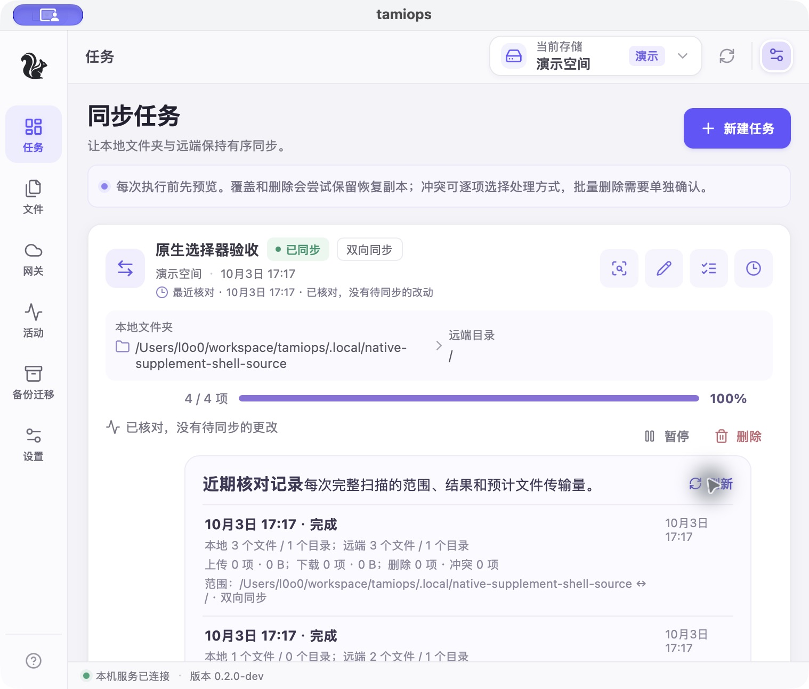

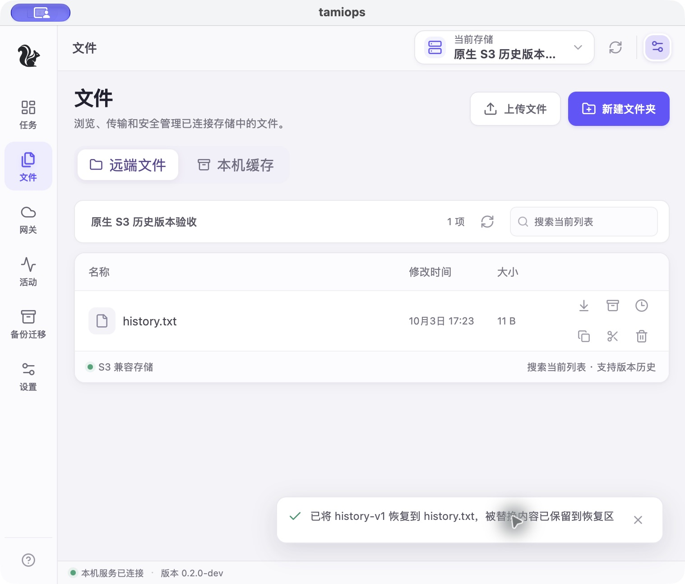

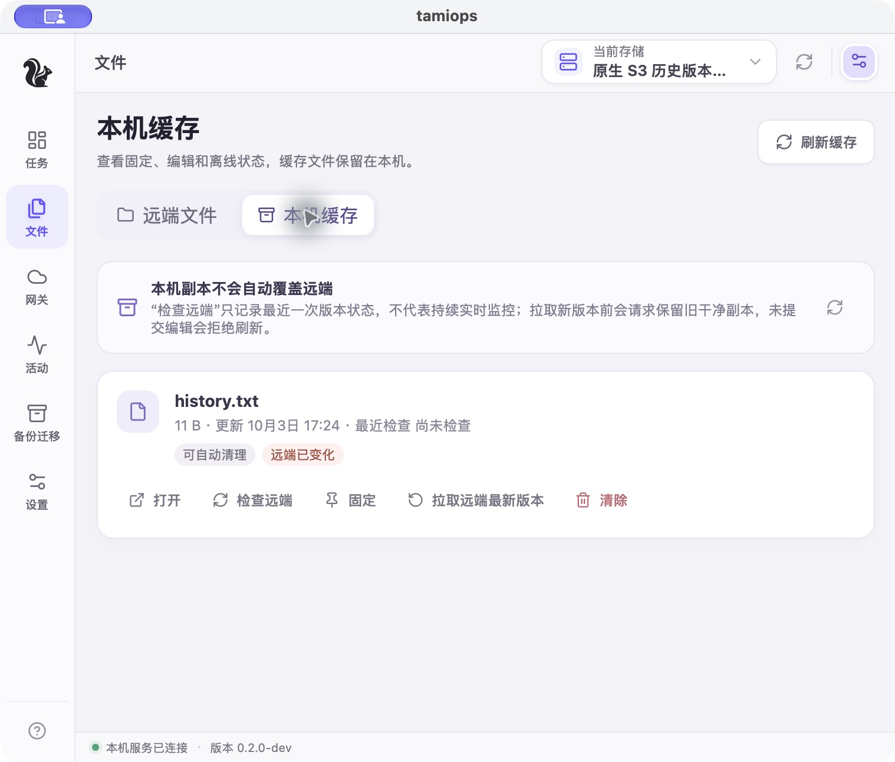

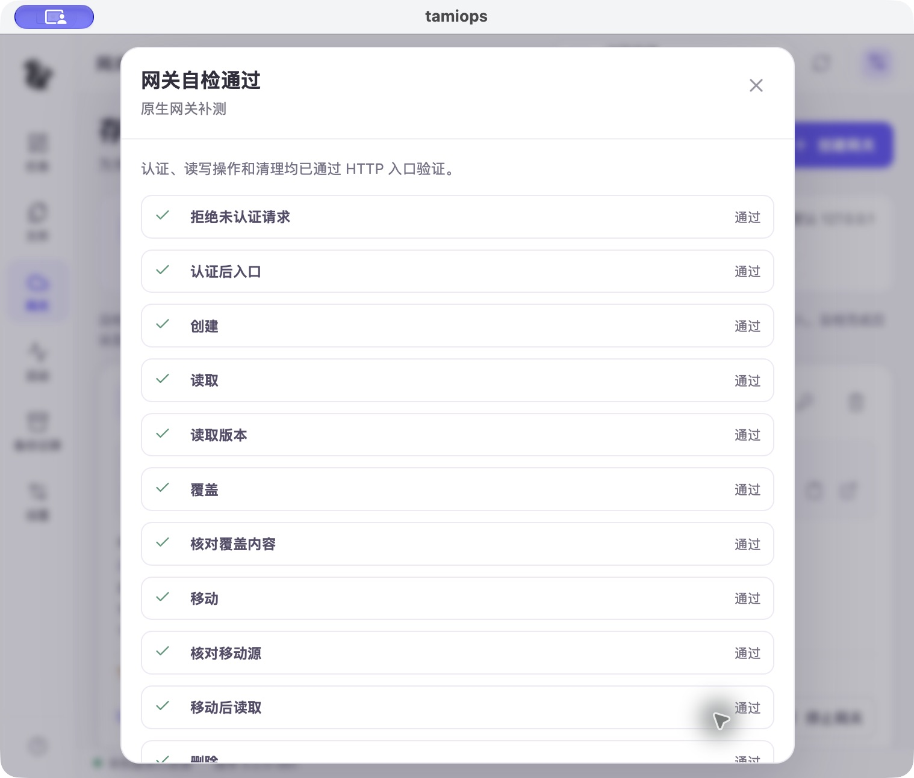

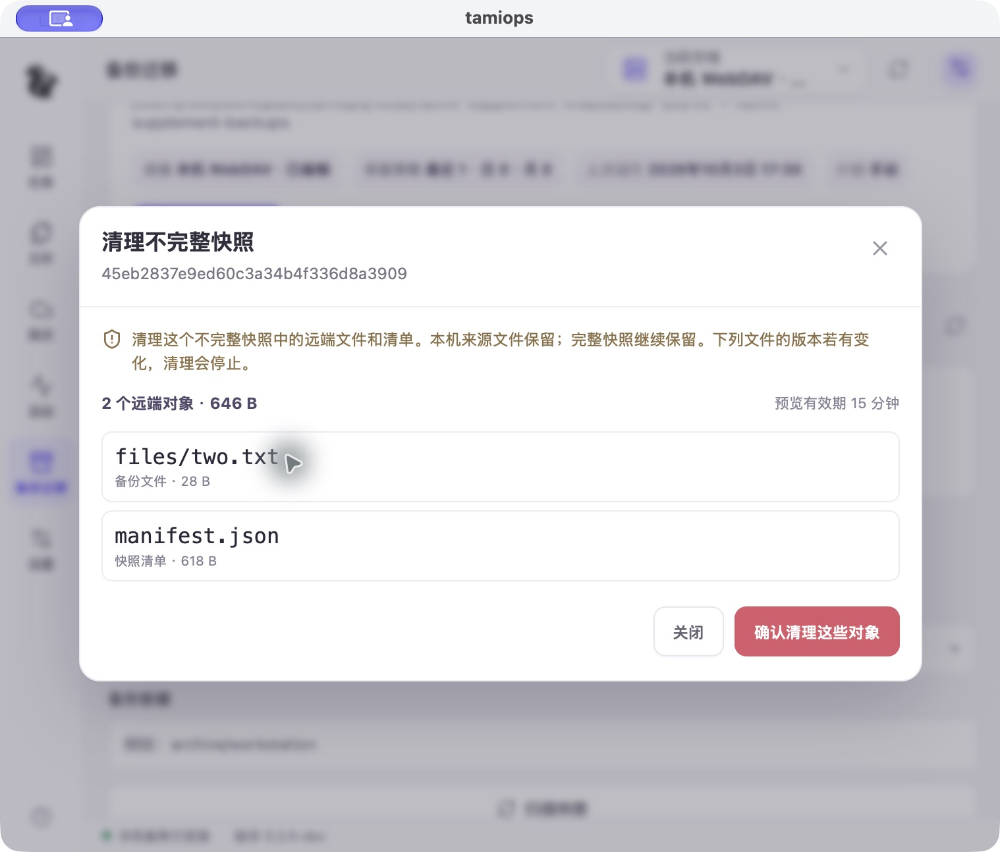

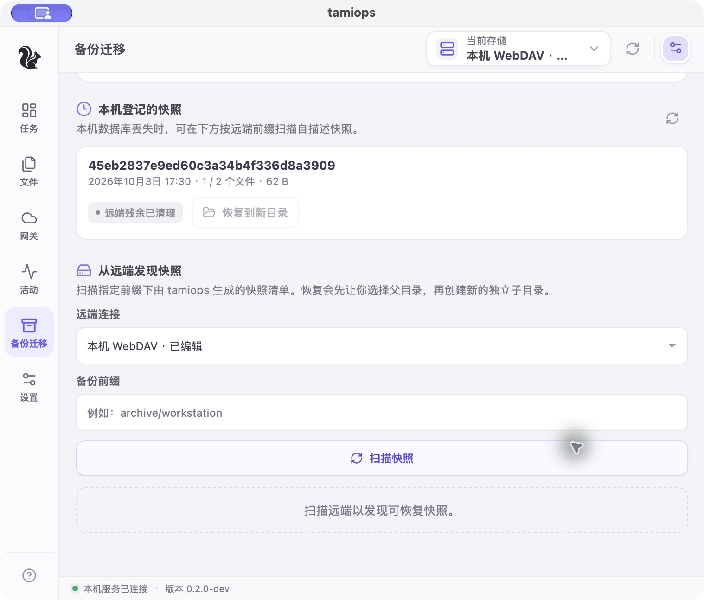
