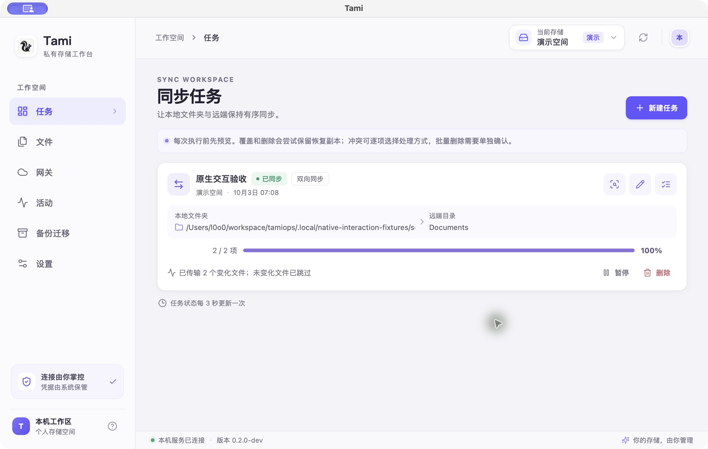
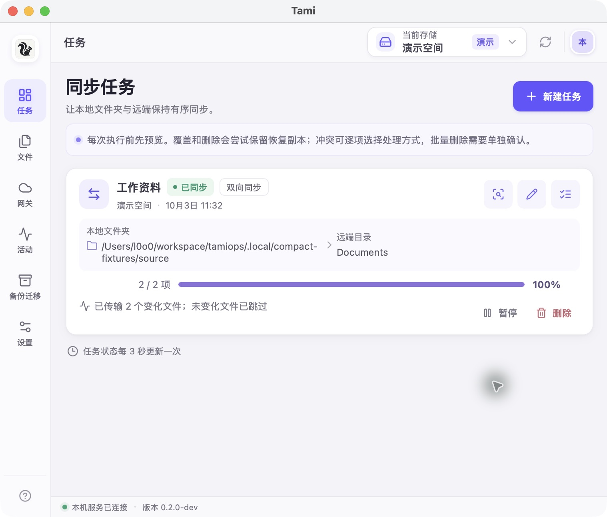
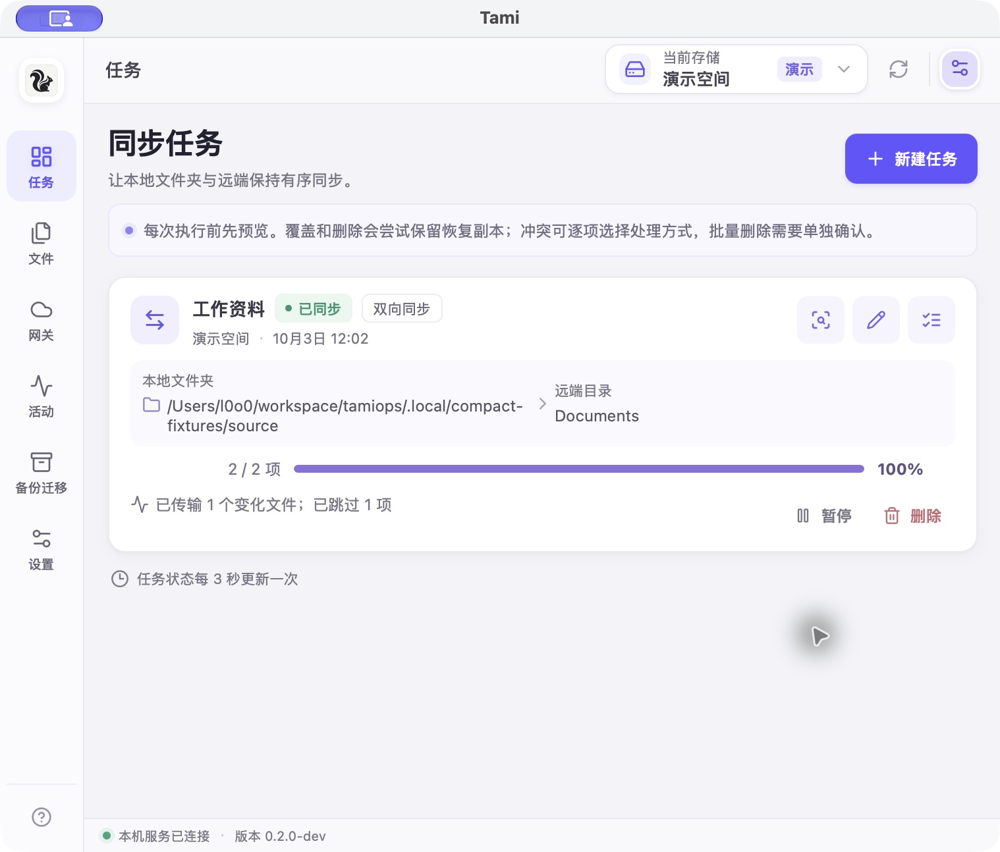
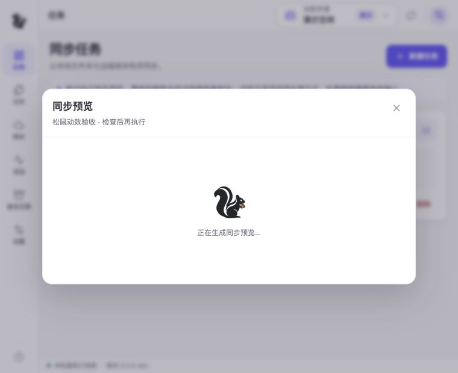

# macOS 原生交互验收

日期：2026-10-03。环境：本机 Apple Silicon macOS，Wails 3.0.0-beta.27，`bin/Tami.app`。使用 `.local/native-interaction`、隔离演示空间和仅监听回环地址的 WebDAV 测试服务；没有使用个人云端文件。

## 已完成的原生操作

| 场景 | 实际操作及结果 |
| --- | --- |
| 同步 | 原生目录选择器选取测试目录，预览显示 1 上传、1 下载；执行后 2/2、100%、已同步 |
| 保存 | 配置导出与远端文件下载打开 macOS 保存面板；文件实际落盘，配置 JSON 可解析且不包含秘密凭据 |
| 缓存编辑 | 缓存文件由系统默认编辑器打开；在 VS Code 修改并保存，刷新后识别“本地已编辑”；确认写回后远端提交成功、脏标记清除 |
| 后台服务 | 创建只读回环网关，关闭主窗口后仍可通过认证 GET 取得正确字节；再次打开应用包恢复窗口，访问统计显示该请求 |
| 退出 | 主窗口下使用 ⌘Q 正常退出；最终修复后，打开原生保存面板再从应用菜单退出，进程也正常结束 |
| 登录启动 | 修复后原生保存生成的 LaunchAgent 包含二进制、`--data-dir` 及正确工作区，`RunAtLoad=true`；关闭并保存后文件移除，恢复测试前状态 |
| 重复启动 | 启动第二个桌面进程后正常返回，原进程 PID 不变且窗口仍可交互，没有数据目录锁错误 |
| 通知失败反馈 | 本机系统返回“Notifications are not allowed for this application”；界面立即显示内联错误，开关恢复为未启用。未将权限拒绝当作授权成功或通知送达 |
| WebDAV 连接 | 修复目录缺少 ETag 的处理后，原生添加本机 WebDAV 成功，文件列表显示测试种子文件 |
| 凭据持久化 | 结束进程后重新启动同一工作区，无需重新输入凭据即可浏览受 Basic Auth 保护的 WebDAV 文件；使用默认系统钥匙串 |

## 本轮发现的问题

- 原生保存对话框打开时从应用菜单退出，主线程与 Core 任务等待互相阻塞。仅取消对话框等待后，原生复测仍发现 WebView 响应写回等待主线程：最终调整为先完成 Core 的任务登记，再写 HTTP 响应，并保留可取消的对话框等待。阻塞响应写入的回归测试与最终原生退出复测均已通过。
- 系统通知授权在本机没有返回可见授权结果，原 SDK 会长时间等待。现已增加 15 秒等待上限、退出取消、表单等待说明与内联错误；失败恢复已保存的通知/登录启动开关，迟到授权不会写入偏好。原生权限拒绝的失败反馈及开关恢复已验证；15 秒超时由自动回归覆盖，通知送达未验证。
- 登录启动配置遗漏 `--data-dir`。现已在三平台配置生成中保留工作区路径，并测试中文、空格及特殊字符。
- 第二个桌面进程原先在系统单实例通知前打开 Core，可能被数据目录锁提前拒绝。现已先处理系统单实例；并用同步保护保存启动期间的聚焦请求。
- 本机标准 WebDAV 集合响应对目录 `getetag` 返回 404，客户端误判整个连接失败。已修复并原生复测通过；仅对已确认的集合放宽缺失 ETag，普通文件和其他失败仍保持检查，添加属性顺序与目录列表回归测试。

## 自动回归与最终复测状态

`make check`、新增 Core 修复后的 `go test -race ./internal/core`、`go vet ./...`、`make build cli`、签名和 plist 检查通过，共 174 个 Go 测试函数。新的 macOS 包约 23 MiB。独立评审检查了对话框/响应退出等待、单实例聚焦和 WebDAV 属性解析。

前一轮曾因主机自动锁屏中断；后续紧凑布局验收时已补测保存弹窗中退出、单实例第二进程、登录启动参数和通知权限拒绝反馈。系统通知送达、托盘菜单点击与真正注销登录仍不在已通过范围。

## 证据范围

回环夹具只能证明本机协议与原生操作链路，不等于真实云厂商兼容。通知送达、真正注销再登录后的自动启动、托盘菜单直接点击，以及 Windows/Linux 桌面尚未据此验收。后续修复复测结果在本文件继续补充，不以代码编译代替原生测试。

## 紧凑窗口验收

按用户打开的坚果云和 magpie 的窗口布局调整：默认内容区 760×620，最小 620×500，窄窗口使用 64px 导航栏；收紧页头和留白，保留中文导航与可读正文。长路径折行，文件操作在固定区域换行，网关和磁盘卡片在小窗口改为单列，长表单在弹窗内部滚动。

- 浏览器分别在 760×620、620×500 检查任务、文件、网关、活动、备份迁移、设置：页面滚动宽度等于可视宽度，没有整页横向溢出。统计表保留局部横向滚动。
- 最小窗口实测任务编辑并保存、网关创建/TLS扩展表单/访问弹窗、备份长表单取消与 Escape 关闭；文件普通行的五个操作按钮可见。未借此声称真实 S3 历史版本链路已测。
- 新原生包以紧凑默认尺寸启动，实测新建同步、预览、执行完成，保留演示窗口供查看。前端类型检查、生产构建与 macOS 打包通过。
- 临时浏览器与回环开发宿主已关闭；登录启动恢复为关闭，测试未访问用户的真实云端文件。

## 细节与交互复查（2026-10-03）

保留默认 760×620、最小 620×500，补充以下实测与修复：

- 多文件上传固定选择文件时的连接和目录。回环测试宿主为每次上传增加 3 秒延迟；上传两个样例后立即进入 Documents，两个文件仍全部出现在最初的根目录，当前页面未被跳回。单独模拟一个 409 失败与一个成功，界面保留“成功 1 个，失败 1 个”、失败文件名和原因，不再被成功提示覆盖。
- 文件夹创建、目录删除清单预览均从 UI 完成；异步目录预览、版本和缓存读取增加过期响应保护，确认操作捕获原目标。目录删除预览显示真实目标与逐项清单，本轮没有执行清单中的删除。
- 弹窗打开时聚焦输入，背景不可操作；Tab 可达错误通知关闭按钮，关闭通知后焦点回弹窗；Escape 关闭普通弹窗后回到触发按钮。连接菜单 Escape 也返回原按钮。
- 同步预览中打开冲突确认，实测仅顶层对话框可操作；Tab 在子弹窗内循环，第一次 Escape 只关闭子弹窗并回到“保留两份”，第二次 Escape 关闭父弹窗并恢复页面。共享弹窗栈置于 Vue 模块作用域，避免每实例独立栈失效。
- 弹窗提交时产生的错误通知可见且可关闭；错误保留至手动关闭，长错误内容有高度上限和内部滚动。创建测试网关时用无效用户名验证了提交失败反馈。一次性密码在 620×500 下完整显示，关闭按钮禁用，Escape 不会误关，需点击“已安全保存”；重置密码页面另有保存后保持停止的出口，本轮未重置实际凭据。
- 六个页面在 620×500 下页面和内容区均无横向溢出。长表单保留一个主要垂直滚动区域；面包屑支持滚动和完整路径提示。补全了图标按钮名称、标签选中状态，设置页自动规则下方新增保存入口。
- macOS 新包实际新建任务、预览并执行，预览为 1 项传输、1 项跳过，完成显示“已传输 1 个变化文件；已跳过 1 项”，队列进度为 2/2、100%。传输、删除、跳过、建目录和状态维护分别计数，空计划明确显示无需同步。

验证：`make check`（竞态检测、Go vet、前端类型检查与生产构建）、`go vet ./...`、`make build cli`、macOS 签名和 plist 检查通过。仓库现有 176 个 Go 测试函数，新增回归覆盖混合操作完成统计和空计划。构建仍有原有 macOS 链接器警告，均以退出码 0 完成。测试使用独立目录和隔离演示空间；临时浏览器与延迟宿主已关闭，原生演示窗口保留供查看。

## 透明图标更新（2026-10-03）

图标底板及内部留白改为真正的透明通道，替换 `build/assets/app-icon.png` 和 `frontend/public/app-icon.png`；侧栏和关于页图标容器也移除底色，macOS 菜单栏使用 template 图标。由内置 imagegen 编辑，完整提示词见 [生成记录](../build/assets/app-icon-generation.txt)。

`make build`、`go vet ./...` 和 macOS 签名检查通过。PNG 与重新打包 ICNS 的 16px、128px、1024px 图标均检查到透明像素及四角 alpha=0，没有不透明浅色底板。浏览器验证侧栏与关于页图片加载成功、容器背景透明；本轮保留用户当前设置窗口，新原生资源于下一次启动生效。临时预览宿主与浏览器已关闭。

## 英文名称统一为 tamiops（2026-10-03）

界面品牌、页面标题、关于页、演示欢迎文件、应用菜单文案与文档统一使用小写 `tamiops`。macOS 包输出为 `bin/tamiops.app`，命令行工具输出为 `bin/cli/tamiops`；Windows/Linux 构建脚本同步更新名称。新建网关的默认用户名为 `tamiops`，已保存的网关账号保持原值。

保留原 `Tami` 数据目录、`io.tamiops.tami` 应用和钥匙串标识、登录启动注册项，继续读取既有数据与凭据。CLI 优先读取 `TAMIOPS_VAULT_KEY`，兼容旧 `TAMI_VAULT_KEY`；新增测试覆盖优先级、旧变量回退及无效新变量报错。已启用登录启动时，桌面启动会更新原注册项中的可执行文件路径，以适配应用改名或移动。

浏览器实测页面标题和品牌、演示空间中的“欢迎使用 tamiops.md”、“关于 tamiops”及创建网关表单默认用户名。`make check`、最终受影响 Go 包竞态测试、`make build cli`、独立目录下 CLI status、plist 字段和 macOS 签名检查通过；现有 179 个 Go 测试函数，macOS 包约 21 MiB。未主动退出用户旧版窗口；本轮未启动新包的原生界面，因此原生菜单显示与登录启动路径刷新未作为实机通过项，Windows/Linux 仅更新构建配置。临时浏览器与预览宿主已关闭。

## 松鼠 SVG 动效（2026-10-03）

重新绘制与现有图标一致的卷尾松鼠，使用真实透明背景、深色剪影及暖棕色坚果。两份独立 SVG 位于 `frontend/src/assets/squirrel-logo.svg`（1,897 字节）和 `squirrel-eating.svg`（3,266 字节）；共享 `SquirrelMark.vue` 组件按状态插入，没有引入动画依赖、轮询或逐帧脚本。

- Logo 鼠标悬停时仅尾巴执行一次 1.05 秒摆动，随后复位；离开取消，重新进入可再次触发。浏览器实际派发鼠标移动，验证关键帧名称、旋转中间矩阵、一次循环和离开后的停止。
- 吃坚果为 1.6 秒抬手与轻咬循环，搭配慢速摆尾、少量碎屑；用于任务首载、同步预览、执行等待、文件/缓存/版本/队列读取。任务卡片仅 `running` / `scanning` 使用动效，完成、暂停和错误保持普通图标。
- 在隔离演示空间实际执行同步；测试宿主仅为观察等待态延迟预览/文件响应，并在实际同步完成后延迟返回结果。浏览器验证预览加载、执行等待、同步完成后动效节点移除、文件列表加载后移除；这不作为真实云传输速度或长时间后台同步的证明。
- 浏览器模拟 `prefers-reduced-motion: reduce`，检查头部、手、尾巴、碎屑和悬停 Logo 的动画均为 `none`，静态形象和状态文字保留。加载提示使用 `role=status`，装饰 SVG 不重复朗读名称。
- 默认 760×620 的同步等待界面及最小 620×500 的文件等待界面验收通过，页面和内容区无横向溢出。状态提示没有人为延时，测试延时只存在于 `.local/mascot-host.go`。
- 前端类型检查、生产构建、`make build`、macOS 签名与 plist 检查通过。新包已在隔离工作区原生启动，Wails WebView 正常显示 SVG Logo，窗口及应用菜单名称为 tamiops，并正常退出。本轮没有在 macOS WebView 中记录悬停中间帧；动效行为与减少动态效果由浏览器验收。临时浏览器、开发服务和原生验收窗口均已关闭。

## 六组功能的解锁后补测（2026-10-03）

锁屏解除后，已用新版 `bin/tamiops.app` 补测系统目录选择、同步容量与扫描历史、暂停执行保护、S3/WebDAV 连接编辑、历史版本恢复与缓存失效、S3 转 WebDAV 网关自检、不完整备份清理，以及未知提交的保护提示。均使用独立数据目录与本机回环夹具，详见[完整原生补测记录](feature-completion-test.md#解锁后的-macos-原生补测)。

这次发现并修复常规连接读写验证回连同进程网关时的写锁等待，增加 3 个回归；整个 Core 包竞态测试、静态检查、最终打包和原生复测通过。当前共 215 个 Go 测试函数，应用包约 22 MiB。所有临时服务和测试凭据均已清理；真实云服务和其他平台仍按既有边界另行验收。

## 与 magpie 一致的融合顶栏（2026-10-03）

参考实机 magpie，macOS 使用 Wails 的 `MacTitleBarHiddenInset` 隐藏独立标题条，保留原生关闭、最小化和缩放按钮。现有 52px 页头延伸覆盖侧栏顶部，松鼠 Logo 移入页头，并为系统按钮预留空间。页头配置 Wails 拖动区域，右侧连接菜单和操作按钮显式排除拖动。布局只在 macOS 原生窗口启用。

新版实际启动后检查默认紧凑窗口与系统缩放后的宽窗口：标题文字不再独占一行，系统按钮、Logo、连接选择和操作按钮没有重叠。连接菜单展开与 Escape 返回焦点、刷新、进入设置和返回任务页均正常。调用原生缩放并恢复紧凑尺寸，通过关闭按钮隐藏后重新显示，页面及本机服务仍正常；最小化按钮与页头拖动已操作，但截图接口不提供窗口位置或最小化状态，未将这些状态作为独立验证通过项。

前端类型检查、生产构建、Go 原生打包、macOS 签名与 plist 检查通过；应用包约 22 MiB。新版窗口已打开。本轮没有改动存储连接或用户文件。

