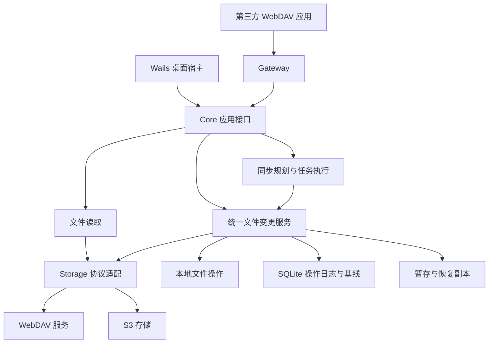

# 小花鼠（Tamias）· WebDAV 与 S3 桌面客户端产品设计

版本：0.3 草案\
整理日期：2026 年 10 月 2 日\
适用读者：产品、设计和研发人员

本文汇总已讨论的产品定位、功能、交互风格和技术边界，作为原型设计及后续开发拆分的依据。当前建议以 Go 和 Wails 为基础，连接用户自有的 WebDAV 与 S3 存储，提供跨平台文件同步，并将 S3 存储通过 WebDAV 提供给其他应用。

WebDAV、S3、跨平台、轻量、增量同步及 S3 转 WebDAV 网关是产品方向。结合开发设备可用磁盘约 20GiB、用户对编译产物占用的顾虑，技术栈调整为 Go 与 Wails。2026-10-03 已开始原型实施，实际功能、限制与验证结果见 [README](../README.md)。本文中的完整功能范围仍是目标设计，不代表均已实现或通过兼容性验证；2026-10-04 英文产品名确定为 **Tamias**，2026-10-05 中文名称确定为 **小花鼠**，可执行文件和安装包前缀为 `tamias`；交付时间及性能指标待确定。

## 产品定位与使用场景

产品定位为连接用户自有存储的轻量桌面客户端，以坚果云的任意文件夹同步、后台运行和少打扰体验作为参考。用户无需迁移到专有云服务即可管理文件、同步目录，并让只支持 WebDAV 的应用接入 S3。

| 场景 | 用户希望完成的事情 | 产品提供的入口 |
| --- | --- | --- |
| 多设备办公 | 在不同电脑上保持工作目录一致 | 同步任务 |
| 使用自有存储 | 访问 NAS、WebDAV 服务和 S3 兼容存储 | 存储连接与文件浏览 |
| 接入已有应用 | 为笔记、阅读器等应用提供 WebDAV 地址 | 存储网关 |
| 避免误操作损失 | 找回误删文件或覆盖前的内容 | 恢复与版本记录 |
| 定期归档 | 按计划保留历史，恢复到某次备份 | 备份任务 |
| 更换存储服务 | 将已有资料复制到新存储并核验 | 迁移任务 |

桌面平台目标为 Windows、macOS 和 Linux。第一版聚焦桌面单用户体验；移动端客户端、团队协作及在线编辑暂不进入首版范围。

## 核心概念与能力边界

| 概念 | 定义 |
| --- | --- |
| 存储连接 | 一组远端地址、访问凭据和能力信息，可供多个任务或网关使用 |
| 同步任务 | 一个本地目录与一个远端目录的对应关系，目标是保持当前文件状态一致 |
| 备份任务 | 按计划保存可恢复的历史，配置保留规则，不自动将源文件删除等同于删除全部历史 |
| 迁移任务 | 将一个存储中的资料复制到另一个存储，核验后再决定是否清理源数据 |
| 网关入口 | 将指定 S3 Bucket 下的路径前缀映射为 WebDAV 根目录，拥有独立账号和权限 |
| 同步基线 | 上次成功同步后记录的文件状态，用于区分单侧修改、双侧修改及删除 |
| 活动记录 | 上传、下载、删除、冲突、恢复和错误等操作的可读历史 |

### 增量同步的分层

首版采用文件级增量：识别哪些文件发生变化，只传输变化的文件。远端支持变更发现扩展时，可以减少目录扫描量；这与减少文件内容的传输量是两个不同能力。

块级增量指只传输一个文件内部发生变化的数据块。标准 WebDAV 与通用 S3 对象接口不能被假定支持任意文件差量更新，因此块级增量作为后续独立方案验证。候选方案是由本应用管理内容块和文件清单；采用该模式后，其他工具不能直接把远端对象当作原始普通文件使用。

分片上传、断点续传、目录变更发现和块级增量分别解决不同问题，界面与宣传材料需要使用准确名称。坚果云官网描述的“只上传修改部分”属于更强的能力，不作为首版已具备的承诺。[坚果云功能说明](https://www.jianguoyun.com/)

### 同步方向与删除语义

| 模式 | 数据方向 | 删除规则建议 |
| --- | --- | --- |
| 双向同步 | 本地与远端互相更新 | 仅在已有基线、目录完整扫描且不存在修改冲突时传播已确认的删除 |
| 仅上传 | 本地到远端 | 默认不删除远端独有文件，不因本地删除而删除远端文件 |
| 仅下载 | 远端到本地 | 默认不删除本地独有文件，不因远端删除而删除本地文件 |
| 镜像 | 指定源端决定目标状态 | 包括删除目标独有内容，后续版本单独提供并预览影响 |

首次连接两个非空目录时没有同步基线，不能仅依据文件缺失或修改时间判断应当删除、覆盖哪一侧。

## 功能范围与版本建议

以下阶段表示建议的交付顺序，不表示功能已经实现或已有日期承诺。首版的恢复能力聚焦本应用能够实际保留的副本，完整历史备份放在后续阶段。

| 功能 | 首版 MVP | 后续增强 |
| --- | --- | --- |
| 存储连接 | WebDAV、S3、自定义地址、连接测试、凭据管理 | 更多经过验证的服务商预设 |
| 文件浏览 | 列表、路径导航、上传下载、创建目录、重命名、删除 | 大目录体验优化与更广范围索引搜索 |
| 文件夹同步 | 双向、仅上传、仅下载，首次预览、排除规则 | 镜像、按时间及网络或电源状态执行 |
| 增量与恢复执行 | 文件级增量、队列持久化、失败重试 | 块级增量、更多服务端续传扩展 |
| 冲突与删除保护 | 保留两份、删除与修改冲突处理、大批量删除保护 | 更丰富的批量处理体验 |
| 传输管理 | 进度、取消、暂停、重试、限速和并发限制 | 按任务优先级调度 |
| S3 转 WebDAV | 本机服务、指定目录、读写或只读 | 局域网 HTTPS、多存储统一挂载视图 |
| 应用专属入口 | 独立凭据、目录隔离、停用与重置 | 经实测确认的应用接入配方 |
| 诊断与活动 | 可理解的错误、连接自检、访问记录 | 导出脱敏诊断包、更多修复引导 |
| 数据恢复 | 冲突副本及本应用操作涉及的可保留副本，标明恢复范围 | 服务端版本浏览、批量恢复与完整保留策略 |
| 备份任务 | 预留任务概念 | 定时备份、历史保留、按备份时间恢复 |
| 存储迁移 | 暂不交付 | WebDAV 到 S3、S3 到 S3、复制校验 |
| 按需缓存 | 传输必要的临时文件及容量管理 | 读取缓存、固定到本地、打开后编辑上传 |
| 配置迁移 | 暂不交付 | 配置导入导出，默认排除密码和密钥 |
| 使用统计 | 基础传输状态 | 按存储、任务、应用统计流量、请求和缓存 |
| 桌面集成 | 托盘、开机启动、关闭窗口后继续运行 | 更多系统文件管理器集成 |
| 独立服务 | 核心逻辑与 UI 解耦 | CLI、NAS 或服务器运行模式 |

虚拟磁盘、占位文件、团队权限系统、在线协作编辑和手机原生客户端属于远期候选，不作为首版验收项。

## 存储连接与文件管理

WebDAV 连接包含名称、服务地址、用户名、密码或应用密码。S3 连接包含名称、Endpoint、Region、Bucket、访问凭据及可选路径前缀；临时凭据和寻址方式等兼容设置在高级选项中呈现。

保存连接前，检查认证和目录访问能力。读写测试使用用户选定范围内的独立临时对象，并报告清理结果；只读连接不执行写入测试。结果区分“连接失败”“凭据无效”“无列举权限”“只读”“可读写”，避免统一显示为网络错误。

文件浏览支持路径导航、当前已加载列表搜索、上传、下载、新建目录、重命名和删除。首版搜索范围明确标注，不把局部列表搜索呈现为完整远端搜索。用户无需创建同步任务即可浏览文件。

| 能力 | WebDAV | S3 |
| --- | --- | --- |
| 目录 | 服务端集合 | 按对象 Key 前缀构建目录视图 |
| 重命名 | 服务端支持时使用 MOVE | 通常复制后删除，可能涉及多个对象 |
| 变更发现 | 探测同步扩展，缺失时扫描 | 列举对象并比较版本或元数据 |
| 上传续传 | 取决于服务端扩展 | 依据具体服务的 multipart 能力 |
| 下载续传 | 依据 Range 和版本验证能力 | 依据范围读取和版本验证能力 |
| 历史版本 | 依赖服务端或本应用保留副本 | 依赖 Bucket 版本能力或本应用保留副本 |

WebDAV 集合变更发现可探测 RFC 6578；不支持时提供扫描回退。[WebDAV 同步扩展](https://www.rfc-editor.org/rfc/rfc6578)

S3 的前缀与目录不同，空目录需要约定标记对象。复制后删除不能提供整个目录的原子重命名；界面应显示进度、部分失败和可恢复状态。[S3 目录说明](https://docs.aws.amazon.com/AmazonS3/latest/userguide/using-folders.html)、[S3 复制与重命名](https://docs.aws.amazon.com/AmazonS3/latest/userguide/copy-object.html)

不同 S3 兼容服务的能力需要独立验证。条件请求用于降低覆盖并发修改的风险；ETag 应作为不透明的版本验证值使用，不能统一视为文件内容 MD5。缺少可靠条件写入时，必须记录并发保护的局限，不能承诺与支持条件写入的连接相同的保证。[S3 条件请求](https://docs.aws.amazon.com/AmazonS3/latest/userguide/conditional-requests.html)、[S3 完整性校验](https://docs.aws.amazon.com/AmazonS3/latest/userguide/checking-object-integrity-upload.html)

## 同步任务设计

### 创建流程

选择存储 → 选择远端目录 → 选择本地目录 → 设置方向与排除规则 → 查看首次同步预览 → 启用任务。

首次预览列出上传、下载、潜在覆盖、冲突和预计传输量。无基线的同名文件只有在能够确认内容一致时才合并，否则保留双方并请求用户选择。首次连接不推断历史删除。

一个连接可用于多个同步任务。首版禁止本地同步根目录互相重叠；共享或重叠远端范围的写入需要统一协调，不能仅依靠每个任务的独立队列。

### 检测与执行

本地监听文件变化，合并连续事件并等待写入稳定；文件监听之外保留定期扫描和重新核对能力。远端轮询间隔可配置，并在任务启动、网络恢复、系统唤醒后核对状态。完整扫描的范围、成功与否和时间必须可追踪。

同步规划比较本地、远端和上次成功同步的基线。元数据用于筛选候选变更，必要时进一步验证内容；不能仅凭大小或修改时间就假定两个文件相同。

操作计划持久化后进入队列。执行前复核相关版本，成功后再更新基线。下载写入临时文件，完成校验后替换目标；上传过程中继续发生本地修改时，当前传输不得将新修改误记为已同步。

程序重启后重新核对未完成操作，避免重复删除或覆盖新版本。支持暂停、取消、重试、限速和并发限制；任务恢复与字节级续传分别显示，服务不支持续传时允许从文件起点重试。

### 冲突与删除规则

| 情况 | 默认处理建议 |
| --- | --- |
| 仅一侧修改 | 向另一侧传输，并在提交前验证目标未发生新变化 |
| 双侧修改 | 保留双方内容，生成带设备与时间信息的冲突副本 |
| 一侧删除且另一侧修改 | 保留修改内容，进入冲突处理 |
| 双向同步中一侧删除且另一侧未变 | 根据有效基线传播删除，并应用恢复和批量保护规则 |
| 目录扫描失败或列举不完整 | 不根据缺失项生成删除操作 |
| 大批量删除 | 暂停相关任务，展示清单与触发原因后由用户处理 |
| 权限、磁盘空间或网络异常 | 保留可恢复状态，给出具体错误及重试入口 |

跨平台需要检测大小写冲突、Unicode 路径、Windows 非法名称及路径长度限制。符号链接默认跳过；不承诺把所有平台的权限和文件属性无损映射到远端。排除规则必须明确区别于真实删除，新增排除规则不能悄悄删除远端已有文件。

任务状态统一为准备中、扫描中、同步中、已同步、已暂停、等待网络、需要处理和失败。每个状态提供可执行的下一步；通知优先呈现冲突、失败或需要用户处理的事项。

## S3 转 WebDAV 网关

网关将选定的 S3 路径映射为 WebDAV 服务，直接读取或写入 S3，不要求预先同步整个 Bucket 到本地。

### 创建与访问

在 S3 连接菜单选择“启用 WebDAV”，设置入口名称、映射目录、只读或读写权限，并生成独立用户名和密码。入口 URL 和凭据可分别复制，支持停用及重置密码。

首版默认只监听本机回环地址。示例 `http://127.0.0.1:端口/dav/notes/` 映射到 `s3://my-bucket/notes/`。请求路径必须限制在该映射范围内，禁止通过路径编码、父目录或 MOVE/COPY 的目标地址越过边界。

| 示例入口 | 远端范围 | 权限 |
| --- | --- | --- |
| 笔记应用 | notes/ | 读写 |
| 阅读器 | books/ | 只读 |
| 扫描工具 | scans/ | 读写 |

每个入口使用独立凭据，不向第三方应用暴露 S3 密钥。入口详情显示状态、地址、映射范围、最近访问、活跃请求和错误。

关闭主窗口后，核心进程继续提供服务；退出应用、电脑休眠或离线会影响服务可用性。未来局域网模式应提供 HTTPS 和明确的访问控制；其他设备访问时必须使用运行网关设备的可达地址。本机地址不能直接用于手机或其他电脑。

### 协议范围

| 方法或能力 | 产品行为 |
| --- | --- |
| OPTIONS | 如实返回已实现且经过验证的能力 |
| PROPFIND | 返回目录、文件大小、修改时间及支持的属性，覆盖客户端需要的 Depth 行为 |
| GET 与 HEAD | 获取内容或元数据，验证范围读取与条件读取 |
| PUT | 接收文件并写入 S3，远端确认成功后才向调用方返回成功 |
| MKCOL | 创建目录标记并保持空目录可见 |
| DELETE | 删除指定资源，处理递归目录操作及部分失败 |
| COPY 与 MOVE | 检查源与目标权限、覆盖条件，并记录多步操作进度 |
| PROPPATCH | 根据首批目标应用需求实现属性保存；不支持的属性如实返回错误 |
| LOCK 与 UNLOCK | 依据目标应用兼容性决定实现范围和排期，不宣称未经验证的锁兼容性 |

实现方法列表不等于完整 WebDAV 合规。状态码、属性、条件请求、路径编码、Depth 以及锁行为都需要专项验证；只有满足对应规范要求后才声明相应兼容等级。[WebDAV 标准](https://www.rfc-editor.org/rfc/rfc4918)

### 写入与一致性

第一版采用远端确认后返回成功的写入方式。可使用有容量上限的本地临时文件，但临时接收完成不能代替 S3 提交完成。离线时不接受无法确认提交的成功写入；远端结果不确定时保留诊断信息并在后续请求中复核。

文件和目录重命名可能是复制后删除。复制未成功不得删除源对象，多对象操作失败时不能伪装为全部成功。S3 中同时存在同名文件 Key 和目录前缀等命名冲突时，需要明确报告，不能静默隐藏其中一项。WebDAV 对单文件 MOVE 有原子性要求，普通 S3 的复制加删除不能对外部直连访问提供同等保证；首版按实测方法和客户端矩阵声明兼容性，明确标注移动限制。

同步引擎、应用内文件操作和网关复用写入协调机制。网关锁若实现，必须被这些内部写入路径共同遵守；直接访问 S3 的外部工具可以绕过网关锁，不能把网关锁描述成整个 Bucket 的全局锁。

网关数据写入会使相关目录索引和缓存失效，并触发受影响同步任务的重新核对。仍需通过远端检查发现绕过网关发生的修改。

### 接入向导与诊断

首版提供通用配置向导及创建、读取、覆盖、重命名、删除等操作自检。应用接入配方在后续增加，只对实际测试的应用版本和配置标注兼容性。

错误信息区分端口占用、账号错误、目录权限不足、S3 认证失败、远端不可达、空间不足和方法不支持。访问记录以入口和操作为单位展示，不记录密码、密钥或完整认证头。

## 恢复与后续任务能力

### 回收站与版本恢复

普通同步默认按原路径上传和更新文件，不另存重复文件，也不自动保留历史副本。连接高级设置提供“覆盖或删除前保留恢复副本”，默认关闭；开启后如果无法取得旧内容或完成保留，必须报告失败，不能显示为“已可恢复”。双方都修改时仍提示冲突，必要时保留冲突内容。历史副本需有容量管理，清理不能误删未提交的数据。

后续整合服务端版本与应用保留副本，展示版本来源、保存时间、保留期限和实际恢复范围。支持下载旧版本、恢复到独立目录及恢复到原路径；恢复原路径前预览影响并检查当前内容是否已变化。

恢复能力取决于实际存在的版本。未开启相应版本能力、又绕过本应用修改的文件，不能承诺找回原内容。保留天数、容量上限及存储位置在实现前确定，避免把无限历史作为默认承诺。

### 备份任务

备份任务支持计划执行、排除规则、历史保留及按备份时间恢复。用户可以选择最近若干版本、按日或按月保留等策略。源目录删除文件不会立即清空所有已保留历史。

一次备份完成后显示已保存范围、失败项和校验结果；存在失败项时标记为部分完成。普通活动文件夹在备份期间可能继续变化，因此不承诺多文件或数据库的应用一致性快照，相关专用能力另行验证。

### 复制与迁移任务

用户选择源与目标存储、目录和排除规则，预览冲突后执行复制。任务保存进度，支持失败重试，并报告内容核验范围。

默认保留源数据。清理源数据作为复制核验后的单独操作。按服务能力选择服务端复制或经本机中转，界面明确数据经过哪里，不将跨存储迁移统一描述为云端直传。

### 按需缓存与文件打开

后续支持浏览远端文件、按需下载并由系统默认程序打开。常用文件可以固定到本地，其他缓存按容量策略清理。

缓存条目关联远端版本，重新访问时检查有效性；断网读取已有缓存时显示离线及可能过期状态。编辑后上传复用同步冲突规则；未提交的修改不能被当作普通缓存清除。完整文件下载和系统级占位文件分阶段实现。

### 规则配置与使用统计

后续增加按时间段、网络和电源状态执行任务的规则，并保留跨平台能力差异。配置导入导出包含连接定义、映射和规则，默认排除密码及密钥；导入时重新选择本地目录并校验远端范围。

统计按连接、任务和入口展示应用观察到的传输量、请求次数及缓存占用。统计范围应标注，不将其等同于服务商最终账单或 Bucket 的全部访问量。

## 信息架构与视觉设计

### 页面组织

主窗口采用左侧导航与右侧内容区，默认打开“任务”。默认窗口为 760×620，最小 620×500；窄窗口使用 64px 图标与中文标签导航，收紧页头和留白，长路径折行、操作按钮换行，长表单在弹窗内部滚动。存储连接同时作为文件页的选择器和设置中的管理项，不为每种协议建立独立主页面。

| 页面 | 内容 |
| --- | --- |
| 文件 | 存储选择器、路径导航、文件列表、文件操作及历史入口 |
| 任务 | 同步任务，后续增加备份和迁移类型；详情内显示传输队列与规则 |
| 网关 | 入口列表、运行状态、复制连接信息、权限及接入诊断 |
| 活动 | 变更、失败、冲突及恢复记录，可按任务或入口筛选 |
| 设置 | 存储连接、网络、后台运行、通知、缓存和凭据相关设置 |

首版不必为传输、恢复、诊断各增加主导航项：传输属于任务详情，历史属于文件详情，诊断属于连接或网关详情。全局传输摘要保持随时可见。

### 截图风格提取

视觉参考来自用户提供的截图。提取浅灰背景、白色圆角面板、紫蓝强调色、淡紫选中态、细边框、克制阴影及宽松留白。截图中的产品名、模型名称和图标仅作为参考画面内容，不进入本产品需求。

| 设计项 | 建议参数或做法 |
| --- | --- |
| 页面背景 | #F4F4F7 |
| 面板背景 | #FFFFFF |
| 主文字与次文字 | #24242B 与 #92929F，最终以可读性和对比度检查调整 |
| 强调色与选中底色 | #6354FF 与 #EEEBFF |
| 边框 | #E5E5EB，约 1px |
| 圆角 | 主面板 18 至 22px，控件 10 至 12px |
| 图标 | 简洁线性图标，协议图标少量彩色 |
| 状态 | 同时使用图标和文字，颜色只作辅助 |
| 密度 | 任务卡片保留留白，文件列表使用更紧凑行高 |
| 字体 | 优先使用系统界面字体，保证中文与路径可读性 |

上述颜色与尺寸是根据截图提出的设计建议，并非从原始设计文件提取的精确参数。焦点态、键盘操作、对比度和窗口缩放需要在原型中验证。

存储选择器借鉴截图中的浮层结构：顶部搜索、左侧全部或协议分类、右侧连接列表。连接项显示名称、主机、状态与选中标记。

任务卡片示例：名称“工作文档”；映射“Documents ↔ NAS / 工作文档”；状态“已同步”；附带最近检查时间，以及打开文件夹、立即同步和更多菜单。冲突时直接显示“2 个文件需要处理”，点击进入对应清单。

网关卡片示例：名称“笔记存储”；状态“运行中”；映射“S3 / my-bucket / notes”；范围“仅本机访问”；权限“读写”；主要操作为复制连接信息、查看访问记录和停止服务。

托盘面板保留整体状态、当前传输、最近活动、暂停同步和打开主窗口。暂停同步与停止网关采用不同操作，避免用户暂停任务时意外断开其他应用。

## 技术方案建议

采用一个 Go 后端宿主、一个 Go module 和四组内部包：desktop 负责 Wails 绑定、窗口和托盘；core 负责文件服务、同步规划、持久任务、状态与恢复；storage 负责 WebDAV 和 S3 适配；gateway 负责 HTTP 与 WebDAV 请求转换。前端建议采用 Vue 3、TypeScript 和 Vite，具体依赖版本在协议原型通过后锁定。

桌面原型优先验证 Wails v3 的托盘和窗口生命周期，并固定所用版本。官方当前将 v3 标为 Beta，发布前必须完成三平台的关闭窗口后运行、托盘退出和休眠恢复验证，不能把桌面 API 的稳定描述等同于正式稳定发行。[Wails v3 状态](https://v3.wails.io/)

完整模块、数据契约、操作状态、数据库组织及实现顺序见[系统架构文档](architecture.md)。

同步任务和网关共用文件变更服务，分别保留持久调度与 HTTP 请求的执行方式。网关不依赖同步引擎，也不直接调用 S3 SDK。所有写入共同执行权限检查、资源锁、版本前置条件、按设置保留恢复副本和提交结果记录。

数据库使用 SQLite，文件内容放在独立暂存或恢复目录，可取用的秘密留在系统凭据库。观察状态、同步基线与操作日志分别保存；网关更新远端后只触发同步重新核对，不能直接把任务标记为已同步。

远端提交与本地数据库之间没有共同事务。超时、进程退出或数据库失败导致结果不明时，先核对实际远端状态再决定重试，不盲目重复覆盖或删除。网关只在远端确认及必要结果记录完成后返回成功。

首版 Core 与 Gateway 在 Wails 的 Go 原生进程内运行，关闭窗口与退出程序分开处理；未来无界面宿主复用它们。桌面通过 Go 与前端绑定调用核心，用户文件内容不穿过 UI，也不要求额外启动第二套语言后端。[Wails 工作原理](https://wails.io/docs/howdoesitwork/)

轻量目标同时覆盖开发磁盘与应用运行：使用单 module、共享构建缓存和依赖缓存，仅保留必要的开发与发布产物；测试文件按需生成，暂存与恢复副本具有额度。Go 同样存在缓存，不能承诺换语言即可消除磁盘占用，也不应每次构建前清空缓存造成重复编译和写入。缓存机制及维护依据官方说明执行。[Go 构建缓存](https://pkg.go.dev/cmd/go#hdr-Build_and_test_caching)

安装包体积、空闲资源、大目录扫描、网关响应和传输峰值仍以实际测量验证。所有队列、暂存、缓存、历史和日志均设置额度；具体磁盘预算及性能数值在首个原型完成后确认。

## 交付顺序与验收

### 建议里程碑

| 阶段 | 输出 | 通过条件 |
| --- | --- | --- |
| 基础连接与原型 | 连接管理、文件浏览、视觉原型、协议能力清单 | 两类协议完成主要文件操作，并记录服务差异 |
| 同步与网关 MVP | 文件级同步、本机 S3 网关、入口隔离、诊断及基础恢复 | 核心流程完整，以下关键异常场景通过验证 |
| 恢复与效率增强 | 版本整合、备份、迁移、缓存、规则和配置迁移 | 恢复结果和保留边界可验证，任务可恢复 |
| 高级能力 | 块级增量、局域网服务、NAS 模式和系统集成 | 每项能力单独验证兼容性与成本后纳入版本 |

### 首版关键验收场景

以下是拟定验收标准，不代表已有测试结果。

1. 分别连接 WebDAV 与 S3，完成浏览、创建目录、上传、下载、重命名和删除；不支持的能力准确提示。
2. 两个非空目录首次同步可预览影响；缺少基线时不因文件缺失执行删除。
3. 本地与远端并发修改、删除与修改冲突时保留有效内容，不静默覆盖已检测到的变更。
4. 在支持条件写入的连接上，计划生成后发生远端修改时，提交保护能阻止过期写入；不支持的服务单独记录保护边界。
5. 网络中断、程序退出和重启后任务可重新核对并继续；未完成下载不覆盖有效本地文件。
6. 远端扫描失败、分页中断或网络错误不导致推断式批量删除；新增排除规则不触发误删。
7. 大批量删除保护能够暂停任务并展示受影响文件；恢复页面只展示实际存在的副本。
8. 网关无需全量下载 Bucket 即可服务；PUT 仅在远端确认成功后返回成功，S3 失败能反映到客户端。
9. 每个入口的凭据、只读权限和目录边界有效，含路径编码和 COPY/MOVE 目标范围验证。
10. 同步与网关同时写入同一资源时经过协调；内部锁与版本保护的实际保证有测试记录。
11. 复制或目录移动部分失败时，源对象不会因未成功复制而被删除，进度和错误可追踪。
12. 在三个目标桌面系统验证路径、后台运行、凭据库、休眠恢复和托盘行为，并记录平台差异。
13. 至少完成一个目标 WebDAV 应用的完整接入实测，并记录应用版本、服务类型、所需方法和已知限制。
14. 在约定的小文件、大文件和大目录样本上记录性能；日志及诊断信息不包含访问密钥或密码。

## 待确定事项

| 事项 | 当前建议或待验证内容 |
| --- | --- |
| 首批平台验证顺序 | 目标覆盖三个桌面平台，优先验证次序待排期 |
| 首批服务与应用 | 确定具体 WebDAV 服务、S3 兼容服务及接入应用版本 |
| 网关协议兼容范围 | 根据目标应用明确 PROPPATCH、LOCK 和其他行为的首版要求 |
| 并发保护不足的服务 | 确定能力不足时禁用哪些写入、如何提示及允许何种降级 |
| 恢复副本策略 | 确定存储位置、覆盖范围、保留时间、容量和保护失败时的处理 |
| 默认参数 | 轮询间隔、并发数、删除保护阈值、缓存及历史容量 |
| 命名冲突 | 确定 S3 文件与目录同名、大小写及非法路径的处理规则 |
| Wails 与 Go 依赖 | 固定原型版本，验证托盘与生命周期、协议行为及开发磁盘占用 |
| 性能门槛 | 确定测试设备、文件样本、服务环境和目标数值 |
| 块级增量 | 验证专有分块模式、普通文件互通和恢复成本之间的取舍 |

## 品牌动效规范

使用透明背景的 SVG 松鼠，沿用现有图标的深色卷尾剪影。坚果使用暖棕色作为局部点缀，不增加新的动画运行库。

| 场景 | 表现 | 行为 |
| --- | --- | --- |
| 品牌 Logo、关于页 Logo | 松鼠轻摆两下尾巴，身体保持稳定 | 鼠标悬停触发一次约 1.05 秒动作后复位；重新进入可再次触发 |
| 同步执行、任务扫描 | 松鼠抬手吃坚果，头部轻咬，尾巴缓慢摆动 | 仅在操作进行中显示，完成、暂停、失败后停止 |
| 任务、文件、缓存、版本、队列读取和同步预览等待 | 吃坚果松鼠与具体加载文案搭配 | 请求开始显示，结果返回后替换成内容；不为了播放动画延长等待 |

主要等待区域使用约 56–64px 图形，任务卡片与行内等待使用 28–44px，Logo 使用 24–30px，不扩大紧凑窗口。动画不替代进度、错误或状态文字；读屏忽略装饰图形，保留准确状态提示。遵循系统“减少动态效果”，此时展示静态松鼠。

源文件：[摆尾 SVG](../frontend/src/assets/squirrel-logo.svg)、[吃坚果 SVG](../frontend/src/assets/squirrel-eating.svg)；共享组件为 `frontend/src/components/SquirrelMark.vue`。

## 参考资料

以下来源用于核对协议与运行模型，不代表具体服务商或第三方应用已经通过本产品兼容性测试。产品功能和优先级来自本次讨论，视觉参数是设计建议。

- [坚果云功能说明](https://www.jianguoyun.com/)
- [WebDAV 标准 RFC 4918](https://www.rfc-editor.org/rfc/rfc4918)
- [WebDAV 集合同步 RFC 6578](https://www.rfc-editor.org/rfc/rfc6578)
- [S3 目录与前缀](https://docs.aws.amazon.com/AmazonS3/latest/userguide/using-folders.html)
- [S3 复制与重命名](https://docs.aws.amazon.com/AmazonS3/latest/userguide/copy-object.html)
- [S3 条件请求](https://docs.aws.amazon.com/AmazonS3/latest/userguide/conditional-requests.html)
- [S3 完整性校验](https://docs.aws.amazon.com/AmazonS3/latest/userguide/checking-object-integrity-upload.html)
- [Wails 工作原理](https://wails.io/docs/howdoesitwork/)
- [Wails v3 状态](https://v3.wails.io/)
- [Go 构建缓存](https://pkg.go.dev/cmd/go#hdr-Build_and_test_caching)
